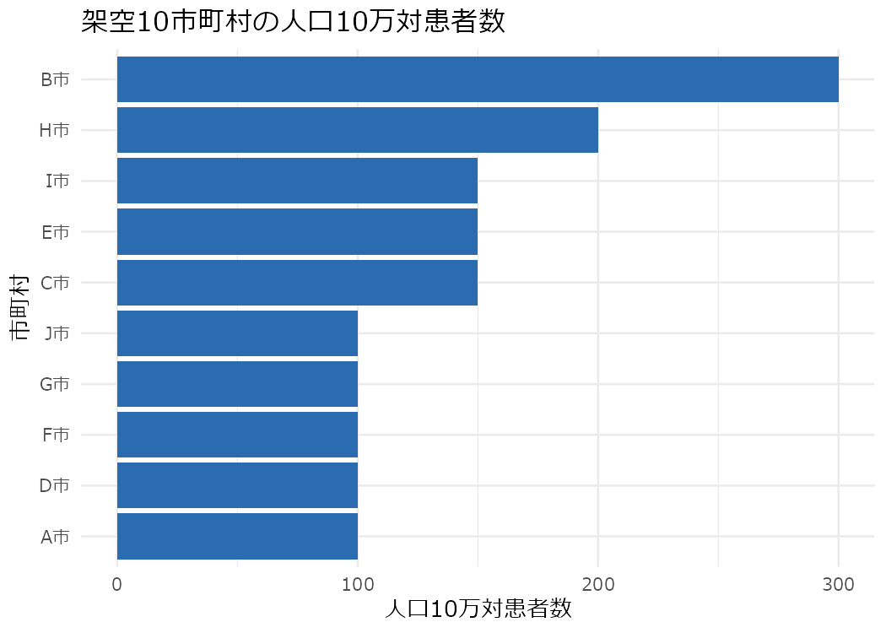

# ハンズオン⓪: 環境準備と進め方

このページは、①〜③のRハンズオン共通の**環境準備と実行方法**をまとめたものです。空間統計そのものの説明はここでは行いません(章1〜6、および①〜③の本編を参照してください)。

## 必要な環境

- R 4.5 系
- パッケージ管理は [renv](https://rstudio.github.io/renv/) を使います。バージョンは `analysis/renv.lock` に固定してあります

## 依存パッケージを揃える

**R を `analysis/` を作業ディレクトリにして起動してください**(RStudio なら `analysis/` を プロジェクトとして開く。ターミナルから起動する場合は `cd` で `analysis/` に入ってから `R` を起動する)。この状態で起動すると `analysis/.Rprofile` が自動で読み込まれ、renv が このプロジェクト専用のライブラリを有効化します。有効化できたら `renv::restore()` を 実行してください。

``` r
renv::restore()
```

`renv.lock` に記録されたバージョンのパッケージが、このプロジェクト専用のライブラリにインストールされます(システムのライブラリやほかのRプロジェクトには影響しません)。**`setwd("analysis")` してから `renv::restore()` を呼ぶだけでは不十分です**(`setwd()` は `analysis/.Rprofile` を読み込まないため renv が有効化されず、`renv::restore()` はシステムのライブラリに直接インストールしてしまいます)。**R の起動時に `analysis/` が作業ディレクトリになっている必要があります。**

この有効化は R セッションの状態として保持されるので、次の節で作業ディレクトリをリポジトリのルートに `setwd()` し直しても解除されません。

**`renv.lock` は「`renv::restore()` で復元できる依存関係の組」の記録であって、このサイトに載っている図を生成した環境の記録ではありません。** サイトの図はレンダリング時のシステムライブラリ(`ggplot2` 4.0.1)で描かれており、`renv.lock` が固定するのは `ggplot2` 4.0.0 です(`sf` 1.0-21 を据え置ける最も新しい日付スナップショットに合わせた結果で、経緯は `analysis/README.md` に記録しています)。そのため `renv::restore()` した環境で knit すると、図の見た目が細部でこのサイトと違うことがあります。一方、**統計量そのものは一致します** — 計算に使う `sf` 1.0-21 / `spdep` 1.4-1 / `CARBayes` 6.1.1 は、`renv.lock` とレンダリングに使ったシステムライブラリとで同じ版だからです。

## `.Rmd` をダウンロードして自分で実行する

各ハンズオンページの末尾に、そのページのもとになった `.Rmd` へのリンクがあります。ダウンロードしたら、**作業ディレクトリをリポジトリのルートに設定してから** knit してください。

``` r
setwd("path/to/Spatial-epidemiology-training")  # リポジトリのルート
rmarkdown::render("analysis/handson/00-setup.Rmd")
```

ハンズオン内のコードは `data/simulated/toy10_areas.csv` のようにリポジトリのルートから見た相対パスでデータを読みます。作業ディレクトリがルートからずれると、データの読み込みでエラーになります。

## このハンズオンが読むデータの形

①〜③のRハンズオンのコードが前提にしている**データの形**を先に示します。自分の手元にあるデータでこの手順を再現したくなったときの手がかりになります。

### 面データ: 境界と属性を地域コードで結合する

①〜③が扱うのは**面データ(areal data)**です — 地域を単位に、1行1地域で値が並ぶ形です。ただし、境界データ(ポリゴン)を実際に読み込むのは②③だけです。①は架空データを規則格子(行・列)として扱うため`sf::st_read()`を呼ばず、地図も`geom_tile()`で描きます。「面データであること」と「ポリゴンファイルを読むこと」は別の話です。

境界データに属性を結合して地図を描く場面で必要になるのはこの2つだけです: **属性テーブル**(地域ごとの値。CSV)と**境界データ**(地域ごとのポリゴン。GeoJSON など)。この2つを**地域コード**で1:1に結合する、というのがこの場面の準備工程です。②③の解析全体はこれ以外にも入力を読みます — 人口(分母)や、地域どうしの隣接関係を書いた隣接エッジ一覧というファイルも読んでいます。

このリポジトリの実物で示すと:

- 境界: `data/geo/iryoken2.geojson`(339区域)。属性列は `area_code, area_name, pref_code, pref_name, boundary_source` と `geometry`。
- 属性: `data/processed/specialists_iryoken2.csv`。列は `iryoken2_code, iryoken2_name, pref_name, n_specialists_care, n_specialists_all`。

**キーの列名が両者で違います**(`area_code` と `iryoken2_code`)。そのため結合するときは `by = c("area_code" = "iryoken2_code")` のようにキーの対応を明示します。ハンズオン②が境界に属性を結合しているのがこの形です(使う関数が `left_join()` か `inner_join()` かは場面によりますが、キーの対応を明示する点は同じです)。

**ここにゼロ埋めコードの罠があります。** 地域コードは `"0101"` のようなゼロ埋めの文字列です。`read.csv("data/processed/specialists_iryoken2.csv")` を既定のまま呼ぶと、`iryoken2_code` は integer 型として読まれ、値は `101, 102, 103` のように先頭のゼロが落ちてしまいます。この状態では境界側の `"0101"`(character)と型が食い違い、`left_join()` はその場で `Can't join ... due to incompatible types` というエラーを出して止まります(全行 `NA` になって通ってしまうわけではありません)。この罠を避けるやり方は②③で違います。②は `read.csv(..., colClasses = c(iryoken2_code = "character"))` のように**キー列を名指しして**文字列として読みます。③は `read.csv(..., colClasses = c("character", "character", "character", "integer", "integer"))` のように**全5列の型を位置で指定**します。`colClasses = "character"` を全列に指定すると `n_specialists_care` のような数値列まで文字列になってしまうため、②はキー列だけを名指しし、③は4・5列目を `integer` に指定することでこれを避けています。

一方 `sf::st_read("data/geo/iryoken2.geojson")` は GeoJSON 自体が型情報を持つため、`area_code` を最初から character(`"0101"`)として返します。③の `iryoken2_sf$area_code <- as.character(iryoken2_sf$area_code)` は、**結合キーの型を両側で文字列に揃えておくための念押し**であり、`st_read()` が数値を返すから必要になっているわけではありません(実測でも character で返ってきます)。同様の注意は `data/geo/README.md` にもあります。

実データを持っている人が最初に手にするのは**点**(施設の住所・座標)であることが多く、それを地域のポリゴンで集計して1行1地域にすると面データになります。この教材のケーススタディも、施設単位のデータを二次医療圏に割り付けて集計したものです([ケーススタディのデータ(資料)](04-case-study.md))。

### sf オブジェクトは data.frame に geometry 列が付いたもの

`sf::st_read()` の戻り値のクラスは `c("sf", "data.frame")` です。つまり、ふつうの data.frame に `geometry` という列が1つ増えただけのオブジェクトであり、`left_join()` / `mutate()` / `filter()` / `bind_rows()` のような dplyr の操作がそのまま使えます。②③が `st_read()` の結果をいきなり dplyr で加工しているのはこのためです。

**`dplyr::select()` で `geometry` を選ばなくても、`geometry` 列は残ります**(sticky geometry と呼ばれる sf の挙動です)。例えば、339区域・6列の sf オブジェクトに `dplyr::select(area_code)` を適用すると、結果は `area_code` と `geometry` の2列になり、クラスも `c("sf", "data.frame")` のままです。ハンズオン②が `dplyr::select(area_code)` した後でも地図を描けているのは、この挙動によります。

geometry 列を落として普通の data.frame にしたいときは `sf::st_drop_geometry()` を使います(6列の sf オブジェクトが5列の data.frame になります)。

### 境界データの単位が解析単位を決める

手元に用意する境界データの細かさが、そのまま解析の地域単位になります。同じ現象でも、都道府県のように粗い単位で集計するか、二次医療圏のように細かい単位で集計するかで、地図の模様も Global Moran's I の値も変わります。これは MAUP(Modifiable Areal Unit Problem)と呼ばれる論点で、[③MAUPの実演](03-maup.md)が実際に単位を変えて計算し直すことで確認し、[章6](../concepts/ch6-pitfalls.md)がその理論的な整理を担っています。

## 動作確認: 架空10市町村データを読む

環境が整っているか確認するために、架空の10市町村データ(`data/simulated/toy10_areas.csv`)を読み込み、人口10万対患者数を横棒グラフにします。このデータは①〜③のハンズオンでも共通して使う、教材の概念パートに登場する架空データです。

``` r
library(dplyr)

toy10 <- read.csv("data/simulated/toy10_areas.csv", fileEncoding = "UTF-8")

toy10 <- toy10 |>
  mutate(area_name = factor(area_name, levels = area_name[order(rate_per_100k)]))

ggplot(toy10, aes(x = area_name, y = rate_per_100k)) +
  geom_col(fill = "#2b6cb0") +
  coord_flip() +
  labs(
    title = "架空10市町村の人口10万対患者数",
    x = "市町村",
    y = "人口10万対患者数"
  )
```



この図が日本語のラベル込みで表示されていれば、環境準備は完了です。図の日本語フォントはOSに応じて自動選択しますが(Windows: Meiryo、macOS: Hiragino Sans、それ以外: Noto Sans CJK JP)、手元の環境にそのフォントが無く文字が豆腐(□)になる場合は、上の setup チャンクの `base_family` を手元にインストールされている日本語フォント名に書き換えてください。

**注意**: このページは choropleth map(地図)を描きません。地図と Moran's I・LISA・Gi\* は①のハンズオンで扱います。

## 次に進む

- [①地図→Moran's I→LISA→Gi\*](01-map-moran-lisa-gi.md)

---

このページのソース: [00-setup.Rmd をダウンロード](rmd/00-setup.Rmd)
