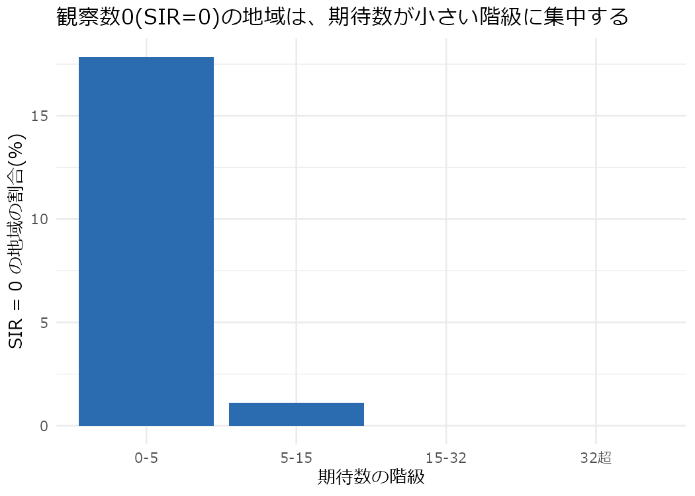
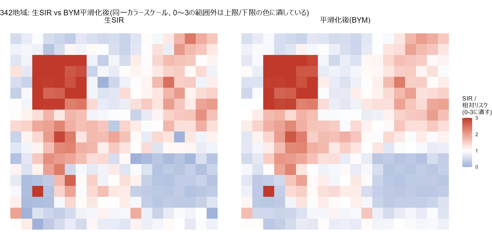
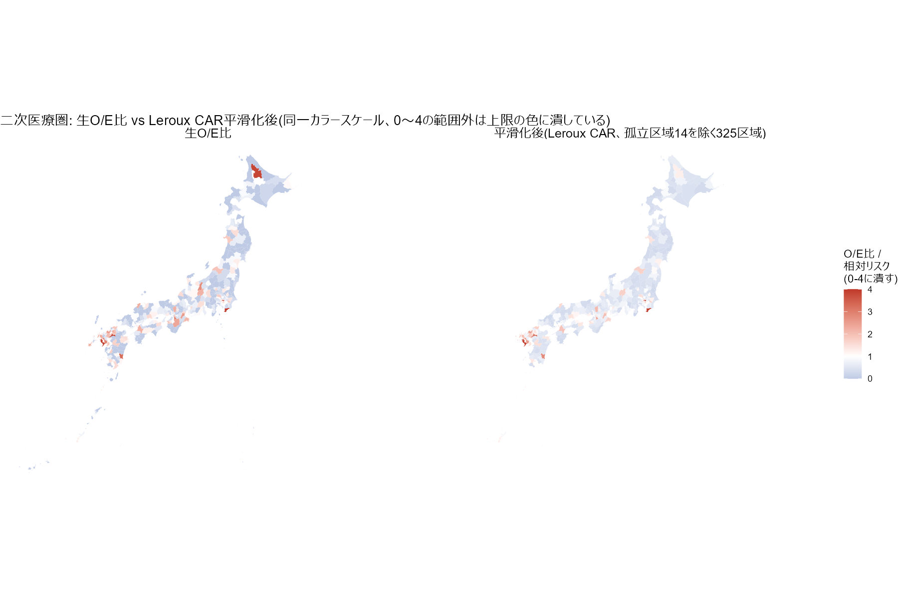

# ハンズオン②: CAR / BYM

## このページで行うこと

このハンズオンは、教材の3段階の型のうち**3. 説明**(なぜそこに多い?)を、Rのコードと実際の数値で再現します。対応する章は次の通りです。

- [章1: 記述 — どこで多い?](../concepts/ch1-descriptive.md)(SIR/SMRの考え方を再利用します)
- [章3: Global Moran's I — 全体として偏っている?](../concepts/ch3-global-moran.md)(残差の空間自己相関を確認する手順を再利用します)
- [章5: 説明 — なぜそこに多い?](../concepts/ch5-explanatory.md)(CAR・BYM・Bayesian smoothingの考え方そのもの)
- [章6: 初学者が注意する5つの落とし穴](../concepts/ch6-pitfalls.md)(小地域の少数例による率の不安定・生態学的誤謬)

パートAでは342地域の合成データで「小地域の率が暴れる → 平滑化で落ち着く」という Bayesian smoothing の効きを確認し、パートBでは実データ(二次医療圏の感染症専門医)で共変量を入れたモデルまで通します。

``` r
library(dplyr)
library(spdep)
library(CARBayes)
```

## 隣接関係の組み立て方(共通の下準備)

[ハンズオン①](01-map-moran-lisa-gi.md)と同じく、`spdep::poly2nb()` や `spdep::mat2listw()` はこの開発環境ではプロセス終了時に異常終了するため使いません。隣接はあらかじめエッジ一覧のCSVとして固定してあるものを読み、`nb` オブジェクトを直接組み立てます(`build_nb()`、`scripts/verify_simulation.R` と同じ手順)。

CARBayes は `spdep` の `listw` オブジェクトではなく、**n×nの0/1隣接行列(`W`)を直接引数に取ります**。`spdep::mat2listw()` はこの行列から `listw` を作る関数であり使えないので、`nb` オブジェクトから直接 `W` を組み立てる関数(`nb_to_W()`)をもう1つ用意します(`mat2listw()` は経由しません)。

``` r
# area_id -> 1..n の連番位置に変換した隣接リストを組み立てる。
# 01-map-moran-lisa-gi.Rmd の build_nb() と同一実装。
build_nb <- function(ids, edges, from = "area_id", to = "neighbor_id") {
  key <- as.character(ids)
  a <- as.character(edges[[from]])
  b <- as.character(edges[[to]])

  stopifnot(all(a %in% key), all(b %in% key))
  stopifnot(setequal(paste(a, b), paste(b, a)))

  n <- length(ids)
  pos <- setNames(seq_len(n), key)
  nb <- split(unname(pos[b]), factor(unname(pos[a]), levels = seq_len(n)))
  nb <- lapply(nb, function(v) if (!length(v)) 0L else as.integer(sort(v)))
  names(nb) <- NULL
  class(nb) <- "nb"
  attr(nb, "region.id") <- key
  attr(nb, "sym") <- TRUE
  nb
}

# nb オブジェクトを CARBayes が要求する n×n の0/1隣接行列に変換する。
# spdep::mat2listw() は使わない(この環境では呼ぶだけでプロセスが終了時に
# 異常終了するため。CLAUDE.md「環境」節を参照)。nb は既に位置(1..n)の
# リストなので、行列への変換はループで十分素直に書ける。
nb_to_W <- function(nb) {
  n <- length(nb)
  W <- matrix(0L, n, n)
  for (i in seq_len(n)) {
    nbrs <- nb[[i]]
    if (!(length(nbrs) == 1 && nbrs == 0)) {
      W[i, nbrs] <- 1L
    }
  }
  W
}
```

# パートA: 合成データで「平滑化前後」を見る

[ハンズオン①](01-map-moran-lisa-gi.md)でも使った342地域(18行×19列の格子、queen contiguity)の合成データ `data/simulated/lattice_areas.csv` を再び使います。このデータの `expected_cases`(期待数)は0.417〜179.4と幅が広く、期待数が1未満の地域も含みます。**小地域では期待値そのものが極端に小さくなる**という、[章6](../concepts/ch6-pitfalls.md)の落とし穴「小地域の少数例による率の不安定」をそのまま再現できるデータです。

``` r
lattice <- read.csv("data/simulated/lattice_areas.csv", fileEncoding = "UTF-8")
lattice_edges <- read.csv("data/simulated/lattice_neighbors.csv", fileEncoding = "UTF-8")

nrow(lattice)
```

    ## [1] 342

``` r
summary(lattice$expected_cases)
```

    ##    Min. 1st Qu.  Median    Mean 3rd Qu.    Max. 
    ##   0.417  11.951  23.366  27.071  32.000 179.419

## Step 1: 生のSIRはどれだけ暴れるか

[章1](../concepts/ch1-descriptive.md)のSIR/SMR(観察数÷期待数)をそのまま計算します。

``` r
lattice <- lattice |>
  mutate(sir_raw = observed_cases / expected_cases)

summary(lattice$sir_raw)
```

    ##    Min. 1st Qu.  Median    Mean 3rd Qu.    Max. 
    ##   0.000   0.655   1.020   1.192   1.553   9.562

**この342地域には、意図的に埋め込んだHH・LL・HLクラスターに由来する本物の地域差(空間的に緩やかに変化する相対リスク)が背景にも乗っているため(`data/simulated/`の生成コードが背景地域にも滑らかな相対リスクを与えています)、単純にSIR全体を期待数に回帰させると、この本物の地域差とPoissonノイズが混ざってしまい、相関係数のような要約統計量では「期待数が小さいほど不安定」という関係がかえって見えにくくなります(実際に試すと相関はほぼ0で、有意にもなりません)。** そこで、Poisson分布そのものの性質から導かれる、より頑健な指標を使います。**観察数がちょうど0になる確率**は`exp(-期待数)`で、期待数が大きくなるとほぼ一瞬でゼロに近づきます。

``` r
for (e in c(1, 2, 5, 10, 20, 32)) {
  cat(sprintf("期待数 = %2d: P(観察数 = 0) = %s\n", e, formatC(exp(-e), format = "e", digits = 2)))
}
```

    ## 期待数 =  1: P(観察数 = 0) = 3.68e-01
    ## 期待数 =  2: P(観察数 = 0) = 1.35e-01
    ## 期待数 =  5: P(観察数 = 0) = 6.74e-03
    ## 期待数 = 10: P(観察数 = 0) = 4.54e-05
    ## 期待数 = 20: P(観察数 = 0) = 2.06e-09
    ## 期待数 = 32: P(観察数 = 0) = 1.27e-14

期待数が32(このデータで最も頻出する値)であれば、観察数が0になる確率は理論上ほぼゼロです。したがって、**実際のデータで観察数0(SIR = 0)の地域が期待数のどの範囲に集中しているか**を見れば、背景の地域差に左右されない形で「期待数が小さい地域ほど不安定」という主張を確認できます。

``` r
lattice <- lattice |>
  mutate(e_bin = cut(expected_cases, breaks = c(0, 5, 15, 32.01, 200),
                      labels = c("0-5", "5-15", "15-32", "32超")))

sir_zero_table <- lattice |>
  group_by(e_bin) |>
  summarise(
    n = n(),
    mean_expected = mean(expected_cases),
    pct_sir_zero = mean(sir_raw == 0) * 100,
    .groups = "drop"
  )
sir_zero_table |>
  knitr::kable(digits = c(0, 0, 1, 1), col.names = c("期待数の階級", "地域数", "平均期待数", "SIR=0の地域の割合(%)"))
```

| 期待数の階級 | 地域数 | 平均期待数 | SIR=0の地域の割合(%) |
|:-------------|-------:|-----------:|---------------------:|
| 0-5          |     28 |        2.4 |                 17.9 |
| 5-15         |     90 |       10.3 |                  1.1 |
| 15-32        |    152 |       26.3 |                  0.0 |
| 32超         |     72 |       59.3 |                  0.0 |

``` r
ggplot(sir_zero_table, aes(x = e_bin, y = pct_sir_zero)) +
  geom_col(fill = "#2b6cb0") +
  labs(
    title = "観察数0(SIR=0)の地域は、期待数が小さい階級に集中する",
    x = "期待数の階級", y = "SIR = 0 の地域の割合(%)"
  )
```



期待数0〜5の階級では17.9%の地域でSIRが0(観察数0)になっているのに対し、期待数15を超える階級ではSIR = 0の地域は1つもありません。理論上ありえないはずの値ではありませんが(期待数が中程度でも観察数0はゼロ確率ではありません)、**期待数が小さい地域だけが「観察数0」という極端な値を取りうる**という非対称性が、この表からはっきり読み取れます。期待数が最も小さい地域を具体的に見てみます。

``` r
lattice |>
  arrange(expected_cases) |>
  dplyr::select(area_id, truth_label, population, expected_cases, observed_cases, sir_raw) |>
  head(5) |>
  knitr::kable(digits = 3, col.names = c("area_id", "truth_label", "人口", "期待数", "観察数", "生SIR"))
```

| area_id | truth_label | 人口 | 期待数 | 観察数 | 生SIR |
|--------:|:------------|-----:|-------:|-------:|------:|
|      17 | background  |  521 |  0.417 |      1 | 2.398 |
|     153 | background  |  900 |  0.720 |      1 | 1.389 |
|     238 | background  | 1027 |  0.822 |      1 | 1.217 |
|      85 | background  | 1100 |  0.880 |      0 | 0.000 |
|     221 | background  | 1118 |  0.894 |      0 | 0.000 |

期待数が1に満たない地域では、観察数がわずか1〜2人動くだけでSIRが数倍動きます。これが[章6](../concepts/ch6-pitfalls.md)「小地域の少数例による率の不安定」の実例です。**この不安定さを地図にそのまま塗ると、たまたま観察数が多かった/少なかった小地域が「異常な高値・低値」として目立ってしまいます。** これをどう和らげるかが、このハンズオンの主題(Bayesian smoothing)です。

## Step 2: 空間を無視したPoisson回帰の残差

まず、空間相関を一切考慮しない通常のPoisson回帰を当てます。[章5](../concepts/ch5-explanatory.md)が説明する通り、この回帰は「隣接地域どうしが似ている」という依存性を無視しているため、残差にまだ空間的なまとまりが残っている可能性があります。

``` r
fit_glm_lattice <- glm(observed_cases ~ offset(log(expected_cases)), family = poisson, data = lattice)
summary(fit_glm_lattice)$coefficients
```

    ##              Estimate  Std. Error  z value     Pr(>|z|)
    ## (Intercept) 0.1958449 0.009423484 20.78264 6.214903e-96

このモデルは切片だけ(共変量なし)なので、残差そのものが「地図上でどこが期待より多い/少ないか」の空間パターンを表します。[ハンズオン①](01-map-moran-lisa-gi.md)と同じ手順(`build_nb()` → `nb2listw()` → `moran.test()`)で、残差(Pearson残差)にGlobal Moran's Iを計算します。

``` r
lattice_nb <- build_nb(lattice$area_id, lattice_edges)
lattice_listw <- nb2listw(lattice_nb, style = "W")
```

``` r
resid_glm_lattice <- residuals(fit_glm_lattice, type = "pearson")
set.seed(20260819)
moran_resid_lattice <- moran.test(resid_glm_lattice, lattice_listw, randomisation = TRUE)
moran_resid_lattice
```

    ## 
    ##  Moran I test under randomisation
    ## 
    ## data:  resid_glm_lattice  
    ## weights: lattice_listw    
    ## 
    ## Moran I statistic standard deviate = 14.216, p-value < 2.2e-16
    ## alternative hypothesis: greater
    ## sample estimates:
    ## Moran I statistic       Expectation          Variance 
    ##      0.3832415856     -0.0029325513      0.0007378848

残差のMoran's Iは0.3832(p \< 2.2e-16)で、強い正の空間的自己相関が残っています。**このモデルには「地理的にまとまった過剰リスク」がまだ説明されずに残っている**、というシグナルです([章5](../concepts/ch5-explanatory.md)が説明する、通常の回帰分析が見落とすものそのものです)。

## Step 3: CARモデル(Leroux)を当てる

[章5](../concepts/ch5-explanatory.md)のCARモデルを、`CARBayes::S.CARleroux()` で当てます。`W` にはStep 2で組み立てた隣接関係から`nb_to_W()`で作った0/1隣接行列を渡します(`spdep::mat2listw()`は経由しません)。

MCMCの設定は、burn-in 5,000・sampling 15,000・thinning 10(有効なサンプル1,000)としました。この規模(342地域、パラメータ数が少ないモデル)であれば、この設定で1モデルあたり1分弱で収束の目安が得られることを事前に確認しています(収束の確認方法は本節末尾)。

``` r
lattice_W <- nb_to_W(lattice_nb)

set.seed(20260819)
fit_leroux_lattice <- S.CARleroux(
  observed_cases ~ offset(log(expected_cases)),
  family = "poisson", data = lattice, W = lattice_W,
  burnin = 5000, n.sample = 15000, thin = 10, verbose = FALSE
)
fit_leroux_lattice$summary.results
```

    ##                Mean    2.5%  97.5% n.sample % accept n.effective Geweke.diag
    ## (Intercept) -0.0232 -0.0791 0.0243     1000     22.3       257.2        -2.2
    ## tau2         1.2467  1.0131 1.5364     1000    100.0      1000.0         0.3
    ## rho          0.9117  0.7772 0.9905     1000     46.9      1388.7        -0.6

`Geweke.diag`列は各パラメータの収束診断(MCMCの前半区間と後半区間で事後平均に系統的なズレが無いかを検定したz値)です。目安として\|z\| \< 2であれば、この2区間の間で明確な非定常性(収束していない兆候)は見られないと判断します。上の出力ではいずれも\|z\| \< 2に収まっており、収束の目安を満たしています。`rho`(空間相関の強さを表すパラメータ、0で空間相関なし・1で強い空間相関)の事後平均は0.912で、95%信用区間は0.777〜0.991です。1に近い値であることは、Step 2で確認した強い残差の空間自己相関と整合します。

## Step 4: BYMモデルを当てる

[章5](../concepts/ch5-explanatory.md)のBYMモデル(空間相関成分 + 非構造化誤差成分)を`CARBayes::S.CARbym()`で当てます。MCMC設定はStep 3と同じにします(同じ収束基準で比較するため)。

``` r
set.seed(20260819)
fit_bym_lattice <- S.CARbym(
  observed_cases ~ offset(log(expected_cases)),
  family = "poisson", data = lattice, W = lattice_W,
  burnin = 5000, n.sample = 15000, thin = 10, verbose = FALSE
)
fit_bym_lattice$summary.results
```

    ##                Mean    2.5%  97.5% n.sample % accept n.effective Geweke.diag
    ## (Intercept) -0.0237 -0.0578 0.0121     1000     36.8       890.6        -0.3
    ## tau2         1.2598  1.0193 1.5338     1000    100.0       162.5         0.9
    ## sigma2       0.0096  0.0019 0.0288     1000    100.0        15.3         0.1

BYMモデルの`Geweke.diag`もいずれも\|z\| \< 2に収まっています。2モデルのDIC(Deviance Information Criterion、小さいほど当てはまりが良い)を比べます。

``` r
data.frame(
  model = c("Leroux CAR", "BYM"),
  DIC = c(fit_leroux_lattice$modelfit[["DIC"]], fit_bym_lattice$modelfit[["DIC"]])
) |>
  knitr::kable(digits = 1)
```

| model      |    DIC |
|:-----------|-------:|
| Leroux CAR | 2213.3 |
| BYM        | 2201.4 |

このデータではBYMのDICがわずかに小さく、以降の平滑化(Step 5以降)は**BYMモデル**の結果を使います(空間相関成分と非構造化誤差成分の両方を持つBYMのほうが、このハンズオンの主役に据えるモデルとしても素直です)。

## Step 5: 平滑化前後の地図を対比する

**この地図には注意が必要です。** 生SIRの範囲は0〜9.6で、埋め込んだ単独の高値地域(area_id = 269、truth_label = "HL")1つが上限を大きく押し上げています。この1地域に色スケールを合わせると、残り341地域の差(ほとんどが0〜3の範囲に収まっています)が色の分解能以下に潰れてしまい、平滑化の効果が見えなくなります。そこで、**色の範囲を実質的な分布(0〜3、全地域の99パーセンタイル3.4をやや上回る値)に絞り、これを超える値は上限の色に潰して(`scales::squish()`)表示します。** 色の範囲(スケール)そのものは生SIR・平滑化後で完全に共通です。

``` r
lattice <- lattice |>
  mutate(rr_smoothed_bym = fit_bym_lattice$fitted.values / expected_cases)

map_lattice <- bind_rows(
  lattice |> transmute(row, col, ratio = sir_raw, type = "生SIR"),
  lattice |> transmute(row, col, ratio = rr_smoothed_bym, type = "平滑化後(BYM)")
) |>
  mutate(type = factor(type, levels = c("生SIR", "平滑化後(BYM)")))

ggplot(map_lattice, aes(x = col, y = row, fill = ratio)) +
  geom_tile() +
  facet_wrap(~type) +
  scale_fill_gradient2(
    low = "#2b6cb0", mid = "white", high = "#c0392b", midpoint = 1,
    limits = c(0, 3), oob = scales::squish
  ) +
  scale_y_reverse() +
  coord_fixed() +
  theme_void() +
  theme(strip.text = element_text(size = 13)) +
  labs(title = "342地域: 生SIR vs BYM平滑化後(同一カラースケール、0〜3の範囲外は上限/下限の色に潰している)", fill = "SIR /
相対リスク
(0-3に潰す)")
```



左の生SIRの地図は色むらが激しく、単独で赤や青に振れているマスが目立ちます。右の平滑化後の地図では、この色むらが落ち着き、代わりに埋め込んだHH・LLクラスターのまとまりがより見やすくなっています。

## Step 6: 平滑化は「情報量」に応じて効いているか

[章5](../concepts/ch5-explanatory.md)が説明する通り、Bayesian smoothingの引き寄せ(shrinkage)の強さは地域の情報量(期待数)に応じて変わるはずです。`truth_label`ごとに、生SIRと平滑化後の相対リスクを比べます。

``` r
lattice |>
  group_by(truth_label) |>
  summarise(
    n = n(),
    mean_expected = mean(expected_cases),
    mean_sir_raw = mean(sir_raw),
    mean_rr_smoothed = mean(rr_smoothed_bym),
    .groups = "drop"
  ) |>
  knitr::kable(digits = c(0, 0, 2, 3, 3), col.names = c("truth_label", "地域数", "平均期待数", "平均生SIR", "平均平滑化後"))
```

| truth_label | 地域数 | 平均期待数 | 平均生SIR | 平均平滑化後 |
|:------------|-------:|-----------:|----------:|-------------:|
| HH          |      9 |      32.00 |     2.972 |        2.972 |
| HL          |      1 |      32.00 |     9.562 |        8.967 |
| LL          |      9 |      32.00 |     0.281 |        0.295 |
| background  |    323 |      26.78 |     1.141 |        1.157 |

`background`(意図的にクラスターを埋め込んでいない323地域)は、生SIRの平均こそ1に近いものの個々の値のばらつきは大きく、平滑化後は1によりまとまります。埋め込んだHH・LLクラスターは、生SIRの時点でもすでに1から離れていますが、平滑化後もその方向は保たれています。

**期待数が特に小さい地域ほど、平滑化で大きく引き寄せられるか**を、Step 1で確認した期待数最小の5地域で具体的に見ます。

``` r
lattice |>
  arrange(expected_cases) |>
  dplyr::select(area_id, truth_label, expected_cases, sir_raw, rr_smoothed_bym) |>
  head(5) |>
  mutate(shrinkage = abs(rr_smoothed_bym - 1) / abs(sir_raw - 1)) |>
  knitr::kable(digits = 3, col.names = c("area_id", "truth_label", "期待数", "生SIR", "平滑化後", "|平滑化後-1|/|生SIR-1|"))
```

| area_id | truth_label | 期待数 | 生SIR | 平滑化後 | \|平滑化後-1\|/\|生SIR-1\| |
|--------:|:------------|-------:|------:|---------:|---------------------------:|
|      17 | background  |  0.417 | 2.398 |    2.006 |                      0.719 |
|     153 | background  |  0.720 | 1.389 |    1.184 |                      0.473 |
|     238 | background  |  0.822 | 1.217 |    1.064 |                      0.296 |
|      85 | background  |  0.880 | 0.000 |    0.750 |                      0.250 |
|     221 | background  |  0.894 | 0.000 |    0.775 |                      0.225 |

最終列は「平滑化前の『1からのズレ』のうち、平滑化後にどれだけ残っているか」の比率です(0に近いほど強く1へ引き寄せられたことを意味します)。期待数が1未満のこれらの地域では、この比率が小さく、生SIRの極端な値が平滑化によって大きく縮小されていることが分かります。一方、期待数が大きい`background`地域(たとえば期待数100を超える地域)では、生SIRと平滑化後の差はわずかです。

``` r
lattice |>
  filter(truth_label == "background", expected_cases > 100) |>
  dplyr::select(area_id, expected_cases, sir_raw, rr_smoothed_bym) |>
  head(5) |>
  knitr::kable(digits = 3, col.names = c("area_id", "期待数", "生SIR", "平滑化後"))
```

| area_id |  期待数 | 生SIR | 平滑化後 |
|--------:|--------:|------:|---------:|
|      36 | 122.616 | 1.721 |    1.712 |
|     124 | 116.796 | 0.694 |    0.706 |
|     156 | 120.858 | 1.961 |    1.956 |
|     179 | 115.444 | 1.698 |    1.693 |
|     211 | 120.554 | 0.713 |    0.717 |

情報量(期待数)が大きい地域では観察値そのものが十分な情報を持つため、引き寄せがほとんど働きません。これは[章5](../concepts/ch5-explanatory.md)の「引き寄せの強さは地域の情報量に応じて変わる」というトイ例を、実際にモデルを当てた数値で確認したことになります。

# パートB: 実データ(二次医療圏)で共変量を入れる

ここからは、日本感染症学会の専門医名簿から作った二次医療圏レベルの感染症専門医数(`data/processed/specialists_iryoken2.csv`)と人口(`data/processed/population_iryoken2.csv`)を使います。

**専門医数は「疾病」ではないので、SIR/SMRという語をそのまま当てるのは不自然です。** ここでは「人口から期待される専門医数に対する比」という意味で**O/E比**(観察数Observed ÷ 期待数Expected)と呼びます。モデルの構造(Poisson回帰 + オフセット + CAR/BYM)はパートAの疾病データと同じです。

**先に制約を明記します。** この節が使う `n_specialists_care`(診療の場のみの主系列)は、名簿本体1,894名のうち85.9%(1,626名)しか地図に載っていません(未割付・記載なし・国外などで240名が欠測。詳細は[ケーススタディのデータ(資料)](04-case-study.md)「データの制約」)。以下の結果は**この不完全な系列に基づく推定**であり、感染症専門医の「真の分布」を表しているとは言えません。

## データを読み、期待数を作る

`iryoken2_code` / `area_code` はゼロ埋め文字列(`0101`など)なので、`colClasses`で明示的に文字列として読みます(先頭ゼロが落ちる典型的な罠。`data/processed/README.md`にも同じ注意があります)。

``` r
specialists <- read.csv(
  "data/processed/specialists_iryoken2.csv", fileEncoding = "UTF-8",
  colClasses = c(iryoken2_code = "character")
)
population <- read.csv(
  "data/processed/population_iryoken2.csv", fileEncoding = "UTF-8",
  colClasses = c(area_code = "character", pref_code = "character")
)
adjacency_real <- read.csv(
  "data/geo/adjacency_iryoken2.csv", fileEncoding = "UTF-8",
  colClasses = c(area_code = "character", neighbor_code = "character")
)

real <- specialists |>
  inner_join(population, by = c("iryoken2_code" = "area_code")) |>
  arrange(iryoken2_code)

nrow(real)
```

    ## [1] 339

期待数は、全国の専門医数/人口比(粗率)を各医療圏の人口に当てはめた値とします(年齢調整はしていません。年齢構成による標準化ではなく、共変量として高齢者割合を後で回帰式に入れます)。

``` r
national_rate <- sum(real$n_specialists_care) / sum(real$population_2020)
national_rate * 1e5  # 参考: 全国の人口10万対専門医数(care系列)
```

    ## [1] 1.288982

``` r
real <- real |>
  mutate(
    expected = population_2020 * national_rate,
    oe_ratio = n_specialists_care / expected,
    elderly_pct = 100 * pop_65plus / population_2020,
    elderly_10pct = elderly_pct / 10  # 係数を「高齢者割合+10ポイントあたり」で読めるようにする
  )

summary(real$expected)
```

    ##    Min. 1st Qu.  Median    Mean 3rd Qu.    Max. 
    ##  0.2465  1.2818  2.7764  4.7965  5.9875 48.6912

``` r
summary(real$elderly_pct)
```

    ##    Min. 1st Qu.  Median    Mean 3rd Qu.    Max. 
    ##   17.68   28.49   32.29   32.44   36.29   48.73

## 孤立区域(隣接ゼロ)の扱い

`data/geo/README.md`が記録している通り、二次医療圏の隣接グラフには孤立区域(queen contiguityで隣が1つも無い区域)が14件あり、いずれも離島です。CARBayesがこれをどう扱うか、実際に走らせて確かめます。

``` r
nb_full_real <- build_nb(real$iryoken2_code, adjacency_real, from = "area_code", to = "neighbor_code")
n_neighbors_real <- vapply(nb_full_real, function(x) if (length(x) == 1 && x == 0) 0L else length(x), integer(1))
isolated_codes <- real$iryoken2_code[n_neighbors_real == 0]

length(isolated_codes)
```

    ## [1] 14

``` r
isolated_codes
```

    ##  [1] "1313" "1507" "2810" "3207" "3702" "4206" "4207" "4208" "4209" "4311"
    ## [11] "4611" "4612" "4704" "4705"

339区域中14区域が孤立区域で、`data/geo/README.md`が記録している14件と一致します。この隣接行列(`W`)をそのまま`S.CARbym()`に渡すとどうなるか確認します。

``` r
W_full_real <- nb_to_W(nb_full_real)

demo_fit <- tryCatch(
  {
    S.CARbym(
      n_specialists_care ~ offset(log(expected)),
      family = "poisson", data = real, W = W_full_real,
      burnin = 100, n.sample = 200, verbose = FALSE
    )
  },
  error = function(e) e
)

if (inherits(demo_fit, "error")) {
  cat("CARBayesが返したエラー:", conditionMessage(demo_fit), "\n")
}
```

    ## CARBayesが返したエラー: W has some areas with no neighbours (one of the row sums equals zero).

**CARBayesは隣接ゼロの区域があるとMCMCを始める前にエラーで停止します。** CAR/BYMのランダム効果は「隣接地域の平均の周りに分布する」という条件付き分布([章5](../concepts/ch5-explanatory.md))で定義されるため、隣が1つも無い区域ではこの条件付き分布そのものが定義できません。

**ここでは、この14区域を空間モデルの対象から除外します。** 隣を人為的に(たとえば最も近い区域を1本つないで)補うことも技術的には可能ですが、それは実際には存在しない隣接関係をこちらの都合で作り出すことになり、[章2](../concepts/ch2-spatial-weights.md)の「『隣』を先に決める」という原則([章6](../concepts/ch6-pitfalls.md)の落とし穴5「『隣』の定義の事後決定」の反対側の問題)に反します。離島であるという地理的事実そのものが「queen contiguityでは隣が無い」という結果を生んでいるので、無理に隣接を作るより、モデルの対象外であることを明示するほうが誠実だと判断しました。

``` r
real_connected <- real |> filter(!(iryoken2_code %in% isolated_codes))
nrow(real_connected)
```

    ## [1] 325

``` r
nb_connected_real <- build_nb(real_connected$iryoken2_code, adjacency_real, from = "area_code", to = "neighbor_code")
W_connected_real <- nb_to_W(nb_connected_real)
listw_connected_real <- nb2listw(nb_connected_real, style = "W")
```

以降のモデルは、この325区域(339 − 14)を対象にします。地図(後述)では、生O/E比は339区域すべてで示しますが、平滑化後の値はこの325区域にしか存在しません。

孤立区域を除いても、残った325区域の隣接グラフが1つに繋がっているとは限りません。連結成分(お互いに隣接をたどって行き来できるひとまとまり)をBFSで数えます。

``` r
# nb オブジェクトの連結成分をBFSで数える。spdep::poly2nb() は既に済んでいる
# 隣接関係(adjacency_iryoken2.csv)を辿るだけなので、ここでも poly2nb()/mat2listw()
# は使わない。
count_components <- function(nb) {
  n <- length(nb)
  comp <- integer(n)
  cur <- 0L
  for (i in seq_len(n)) {
    if (comp[i] == 0L) {
      cur <- cur + 1L
      queue <- i
      comp[i] <- cur
      while (length(queue) > 0) {
        v <- queue[1]
        queue <- queue[-1]
        nbrs <- nb[[v]]
        if (!(length(nbrs) == 1 && nbrs == 0)) {
          for (u in nbrs) if (comp[u] == 0L) { comp[u] <- cur; queue <- c(queue, u) }
        }
      }
    }
  }
  comp
}

comp_real <- count_components(nb_connected_real)
table(comp_real)
```

    ## comp_real
    ##   1   2   3   4 
    ##  21 250  51   3

325区域は4個の連結成分に分かれます。大きさは250・51・21・3で、`data/geo/README.md`が記録している北海道(21)・本州+四国(250、瀬戸内海を挟む1本のエッジで併合)・九州(51)・沖縄本島側(3)という4つの陸塊にそのまま対応します。**パートAの格子データは18行×19列の単一の連結グリッドでしたが、実データは最初から複数の陸塊に分かれています。** CARモデルは連結していない領域どうしの間で情報を融通できないため、この非連結性はこのあとのモデルの当てはまり・収束のしやすさに影響します。

## 通常のPoisson回帰の残差

``` r
fit_glm_real <- glm(
  n_specialists_care ~ elderly_10pct + offset(log(expected)),
  family = poisson, data = real_connected
)
summary(fit_glm_real)$coefficients
```

    ##                 Estimate Std. Error   z value     Pr(>|z|)
    ## (Intercept)    1.9184997 0.15045512  12.75131 3.065538e-37
    ## elderly_10pct -0.7038028 0.05606289 -12.55381 3.788396e-36

``` r
resid_glm_real <- residuals(fit_glm_real, type = "pearson")
set.seed(20260819)
moran_resid_real <- moran.test(resid_glm_real, listw_connected_real, randomisation = TRUE)
moran_resid_real
```

    ## 
    ##  Moran I test under randomisation
    ## 
    ## data:  resid_glm_real  
    ## weights: listw_connected_real    
    ## 
    ## Moran I statistic standard deviate = 3.1997, p-value = 0.0006878
    ## alternative hypothesis: greater
    ## sample estimates:
    ## Moran I statistic       Expectation          Variance 
    ##       0.113290346      -0.003086420       0.001322832

残差のMoran's Iは0.1133(p 7^{-4})で、高齢者割合を共変量に入れたあとも、まだ有意な正の空間的自己相関が残っています。**高齢者割合だけでは、地理的なまとまりを説明しきれていない**ということです。

## CARモデル(共変量あり): BYMとLeroux

まずパートAのStep 4と同じBYMモデルを、高齢者割合を共変量に加えて当てます。MCMC設定もパートAと同じにします。

``` r
set.seed(20260819)
fit_bym_real <- S.CARbym(
  n_specialists_care ~ elderly_10pct + offset(log(expected)),
  family = "poisson", data = real_connected, W = W_connected_real,
  burnin = 5000, n.sample = 15000, thin = 10, verbose = FALSE
)
fit_bym_real$summary.results
```

    ##                  Mean    2.5%   97.5% n.sample % accept n.effective Geweke.diag
    ## (Intercept)    1.9934  1.1581  2.9250     1000     40.2        58.3         3.1
    ## elderly_10pct -0.7680 -1.0447 -0.5188     1000     40.2        99.0        -2.3
    ## tau2           0.0957  0.0053  0.5765     1000    100.0        12.6         2.1
    ## sigma2         0.3809  0.1820  0.5522     1000    100.0        38.6        -6.1

**ここで、パートAとは違う結果が出ます。** 4パラメータすべてで`Geweke.diag`が\|z\| \> 2になっており、収束の目安を満たしていません(特に`sigma2`はz = -6.1と大きく外れています)。BYMモデルは空間相関成分(`tau2`)と非構造化誤差成分(`sigma2`)の2つの分散パラメータを持ちますが、この2つはデータから弱くしか識別できないことが知られています(どちらの成分がどれだけのばらつきを担っているかを、データだけから明確に切り分けにくいという意味です)。特にこのデータは、直前で確認した通り325区域が4つの陸塊(連結成分)に分かれており、パートAの単一の連結グリッドより空間相関成分の推定が難しくなっていると考えられます。burn-inと本サンプリングを4倍(burn-in 20,000・sampling 60,000・thinning 30)にしても`tau2`・`sigma2`の`Geweke.diag`は\|z\| \> 2のままであることを確認しており(このRmdには含めていません、レンダリングが長くなるため)、サンプル数を増やせば解消する軽微な遅延ではなさそうです。

**そこで、同じデータにCARモデル(Leroux、Step 3と同じ`S.CARleroux()`)も当て、収束と結果を比べます。** LerouxモデルはBYMと違って空間相関の強さを表すパラメータが`rho`1つだけなので、この種の識別性の弱さが起こりにくくなります。

``` r
set.seed(20260819)
fit_leroux_real <- S.CARleroux(
  n_specialists_care ~ elderly_10pct + offset(log(expected)),
  family = "poisson", data = real_connected, W = W_connected_real,
  burnin = 5000, n.sample = 15000, thin = 10, verbose = FALSE
)
fit_leroux_real$summary.results
```

    ##                  Mean    2.5%   97.5% n.sample % accept n.effective Geweke.diag
    ## (Intercept)    1.8463  0.9220  2.6954     1000     27.5        72.5        -0.8
    ## elderly_10pct -0.7572 -1.0498 -0.4622     1000     27.5        71.4         0.8
    ## tau2           0.9352  0.5684  1.3732     1000    100.0       303.4         0.3
    ## rho            0.3967  0.1349  0.6967     1000     42.9       191.7        -0.1

Leroux CARモデルは、すべてのパラメータで`Geweke.diag`が\|z\| \< 2に収まっています。DICも比べます。

``` r
data.frame(
  model = c("BYM", "Leroux CAR"),
  DIC = c(fit_bym_real$modelfit[["DIC"]], fit_leroux_real$modelfit[["DIC"]])
) |>
  knitr::kable(digits = 1)
```

| model      |    DIC |
|:-----------|-------:|
| BYM        | 1177.1 |
| Leroux CAR | 1178.9 |

**以降、共変量の解釈と平滑化の地図には、収束の目安を満たしているLeroux CARモデルの結果を使います。** BYMモデルの結果も参考として残しますが、収束が不十分なパラメータを含む結果を主要な数値として使うのは適切ではないと判断しました。

``` r
beta_row_leroux <- fit_leroux_real$summary.results["elderly_10pct", ]
beta_row_bym <- fit_bym_real$summary.results["elderly_10pct", ]
beta_row_leroux
```

    ##        Mean        2.5%       97.5%    n.sample    % accept n.effective 
    ##     -0.7572     -1.0498     -0.4622   1000.0000     27.5000     71.4000 
    ## Geweke.diag 
    ##      0.8000

``` r
exp(beta_row_leroux[c("Mean", "2.5%", "97.5%")])
```

    ##      Mean      2.5%     97.5% 
    ## 0.4689777 0.3500077 0.6298963

Leroux CARモデルでの高齢者割合の係数(`elderly_10pct`)の事後平均は-0.7572(95%信用区間-1.0498〜-0.4622)です。指数を取ると、**高齢者割合が10ポイント高い医療圏は、人口から期待される専門医数に対する比が0.469倍**(95%信用区間0.35〜0.63倍)になると推定されます。信用区間が1を跨いでおらず、統計的に意味のある関連です。収束が不十分だったBYMモデルの同じ係数の事後平均-0.768と比べても大きくは違わず、**この係数についてはモデル間で結論が変わっていません**(BYMの`tau2`・`sigma2`の収束不足は、空間相関成分と非構造化誤差成分の切り分けに影響する問題であり、共変量の効果そのものの推定を大きく歪めるものではなかったと考えられます)。

**この関連を「高齢者が多い地域だから専門医が集まる/集まらない」という個人レベルの因果として読んではいけません。** これは二次医療圏という地域単位で見た関連であり、後述の「生態学的誤謬」の節で改めて注意します。

## 平滑化前後の地図(実データ)

生O/E比(339区域すべて)と、Leroux CARモデル(直前の節で収束の目安を満たしていたモデル)による平滑化後の相対リスク(モデルの対象である325区域のみ)を、同じカラースケールで並べます。パートAと同じ理由で、**色の範囲を実質的な分布(0〜4、99パーセンタイル4.1をやや上回る値)に絞り、これを超える値は上限の色に潰して(`scales::squish()`)表示します。**

``` r
library(sf)
sf::sf_use_s2(FALSE)

geo_real <- st_read("data/geo/iryoken2.geojson", quiet = TRUE)

real_connected <- real_connected |>
  mutate(rr_smoothed_leroux = fit_leroux_real$fitted.values / expected)

geo_raw <- geo_real |>
  dplyr::select(area_code) |>
  inner_join(real |> dplyr::select(iryoken2_code, ratio = oe_ratio), by = c("area_code" = "iryoken2_code")) |>
  mutate(type = "生O/E比")

geo_smoothed <- geo_real |>
  dplyr::select(area_code) |>
  inner_join(real_connected |> dplyr::select(iryoken2_code, ratio = rr_smoothed_leroux), by = c("area_code" = "iryoken2_code")) |>
  mutate(type = "平滑化後(Leroux CAR、孤立区域14を除く325区域)")

geo_map_real <- rbind(geo_raw, geo_smoothed) |>
  mutate(type = factor(type, levels = c("生O/E比", "平滑化後(Leroux CAR、孤立区域14を除く325区域)")))

ggplot(geo_map_real) +
  geom_sf(aes(fill = ratio), color = NA) +
  facet_wrap(~type) +
  scale_fill_gradient2(
    low = "#2b6cb0", mid = "white", high = "#c0392b", midpoint = 1, na.value = "grey85",
    limits = c(0, 4), oob = scales::squish
  ) +
  theme_void() +
  theme(strip.text = element_text(size = 12)) +
  labs(title = "二次医療圏: 生O/E比 vs Leroux CAR平滑化後(同一カラースケール、0〜4の範囲外は上限の色に潰している)", fill = "O/E比 /
相対リスク
(0-4に潰す)")
```



左の生O/E比の地図では、専門医が0名の医療圏(O/E比0)や、人口の小さい医療圏でたまたま数名の専門医がいることによる極端に高い値が、単独のマスとして目立ちます。右の平滑化後の地図では、こうした単独の極端な値が周辺の情報を借りて落ち着く一方、都市部を中心とした広がりのあるまとまりは保たれています。

## この結果の読み方における制約

上のモデルと地図は、以下の制約の上に成り立っています。

- **分子(`n_specialists_care`)は割付率85.9%の不完全な系列です。** 残る14.1%(268名相当、うち診療の場に限れば163名が未割付)がどの医療圏に多く欠けているかは分かっておらず、この欠測が地図の模様そのものに影響している可能性を完全には排除できません([ケーススタディのデータ(資料)](04-case-study.md)「欠測が地図の模様を作っていないか」で、都道府県単位の割付率と専門医密度の相関がごく弱いことは別途確認されていますが、これは県単位の粗い確認であり、二次医療圏単位でも同じ保証があるわけではありません)。
- **期待数(`expected`)は年齢調整をしていません。** 全国の粗率をそのまま人口に当てはめただけであり、高齢者割合は共変量として別に投入しています。年齢調整済みの期待数を使えば、高齢者割合の係数の解釈は変わりえます。
- **孤立区域14件は空間モデルの対象外です。** これらの区域についてBYM・Leroux CARいずれのモデルも何も推定していません。
- **BYMモデルの空間相関成分・非構造化誤差成分は、この325区域では収束の目安を満たしていません。** 共変量の効果そのものはLeroux CARモデルと大きく違わなかったため主要な数値にはLeroux CARを使いましたが、地域ごとの「空間相関によるまとまり」と「その区域固有のばらつき」の切り分けまでは、このデータ・このMCMC設定では確認できていません。

# 生態学的誤謬についての注意

パートBで確認した「高齢者割合が高い医療圏ほど、人口から期待される専門医数に対する比が高い/低い」という関連は、**あくまで医療圏という地域単位で見た関連**です。これを「高齢者だから専門医にかかりやすい/かかりにくい」のような**個人レベルの関連や因果**として読み替えることはできません。[章6の生態学的誤謬](../concepts/ch6-pitfalls.md)が説明する通り、地域レベルの関連は地域内の個人の分布や他の交絡要因を反映しきれないため、地域相関研究で言えることと言えないことを区別する必要があります。

CAR・BYMモデルはあくまで**地域単位の観察数を、地域単位の説明変数と地域単位の空間相関で説明するモデル**であり、個人単位のデータを扱っているわけではありません。この区別は、CAR/BYMのような空間回帰を使うときに特に見落としやすい落とし穴です。

## まとめ / 次に進む

- 小地域(期待数が小さい地域)は、観察数がわずか1〜2人動くだけでSIRが数倍動きうる。観察数がちょうど0になる(SIR=0)地域も、期待数が小さい階級にしか現れない(小地域の少数例による率の不安定、[章6](../concepts/ch6-pitfalls.md))
- 空間相関を無視した通常のPoisson回帰の残差には、有意な正のGlobal Moran's Iが残ることがある。残差の空間的自己相関は、地理的に未説明の要因が残っているシグナル([章5](../concepts/ch5-explanatory.md))
- CARBayesの`S.CARleroux()`(CAR)・`S.CARbym()`(BYM)は、`spdep::mat2listw()`を経由しない0/1隣接行列(`W`)を要求する。収束はGeweke診断(`Geweke.diag`列)で確認する
- Bayesian smoothingの引き寄せ(shrinkage)の強さは地域の情報量(期待数)に応じて変わる。期待数が小さい地域ほど強く引き寄せられ、大きい地域ではほとんど動かない([章5](../concepts/ch5-explanatory.md)のトイ例を実データで確認)
- CARBayesは隣接ゼロの区域(孤立区域)があるとエラーで停止する。人為的な隣接を作るのではなく、モデルの対象外として明示するほうが「『隣』を先に決める」原則に合う([章2](../concepts/ch2-spatial-weights.md))
- BYMモデルの2つの分散成分は、データ(特に連結成分が複数に分かれている実データ)によっては収束の目安を満たさないことがある。共変量の効果そのものはLeroux CARモデルと比べて大きくは違わなかったが、収束していない結果を主要な数値として使わないことが重要
- 実データでは、分子の欠測(割付率85.9%)・期待数の非年齢調整・孤立区域の除外・BYMモデルの収束不足という4つの制約の上に結果が成り立っている
- 地域単位の関連を個人レベルの因果として読み替えることはできない(生態学的誤謬、[章6](../concepts/ch6-pitfalls.md))

次のハンズオンでは、二次医療圏と都道府県という異なる地域単位で同じデータを集計し直し、MAUP(Modifiable Areal Unit Problem)を実演します([③MAUP](03-maup.md))。

---

このページのソース: [02-car-bym.Rmd をダウンロード](rmd/02-car-bym.Rmd)
