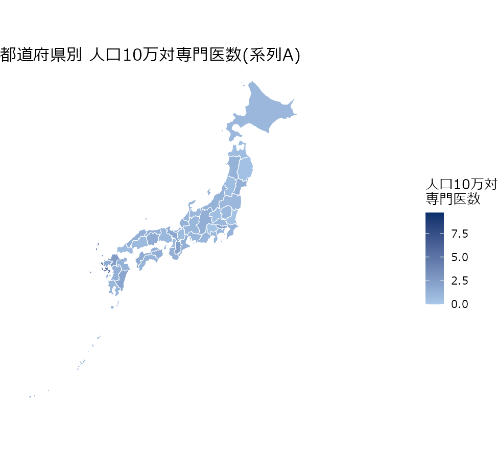
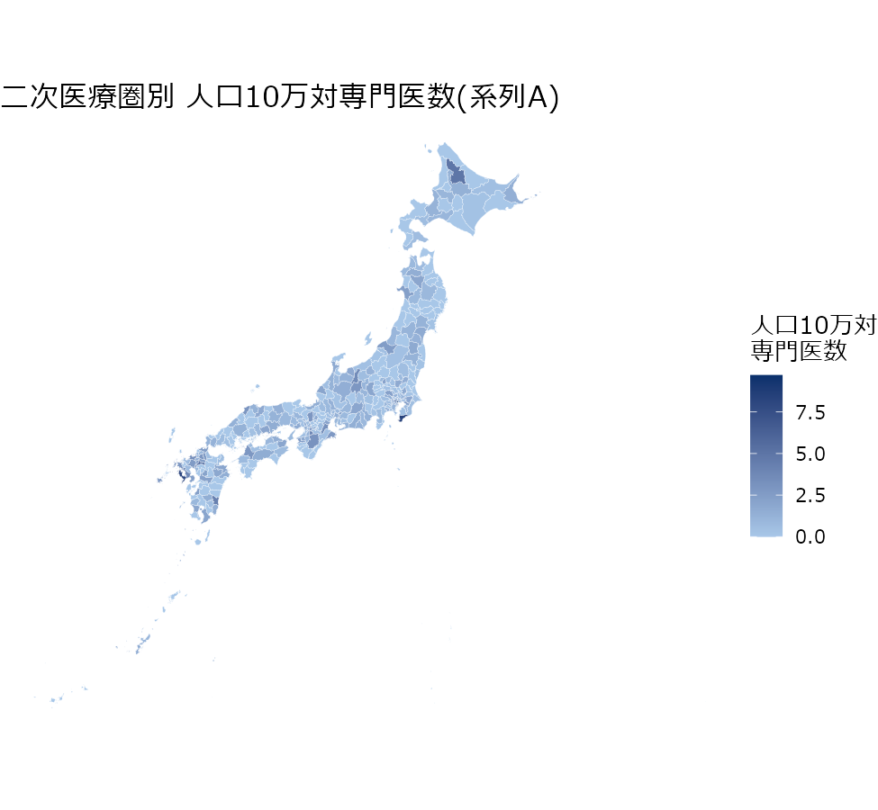
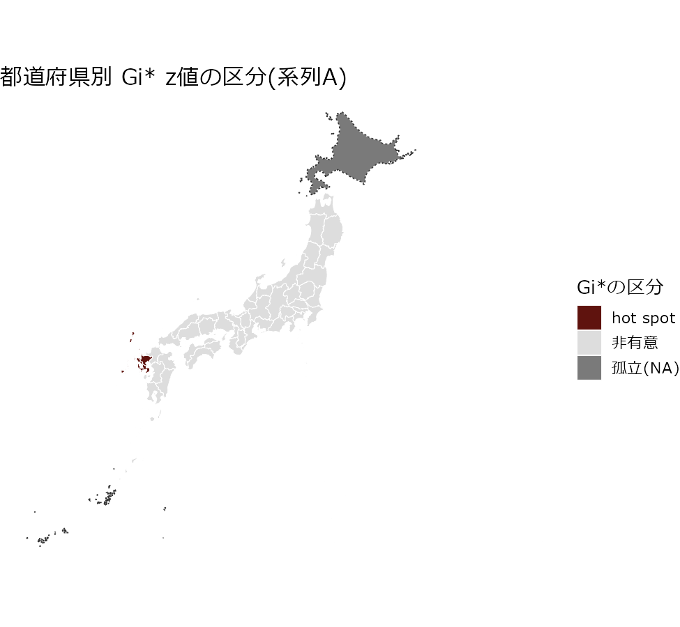

# ハンズオン③: MAUPの実演 — 都道府県 vs 二次医療圏

## このページで行うこと

[章6(落とし穴)のMAUPの節](../concepts/ch6-pitfalls.md)は、「地域単位の切り方を変えると結論が変わる」という MAUP(Modifiable Areal Unit Problem)を scale effect(集計の粗さの効果)と zoning effect(境界の引き方の効果)の2種類に分けて説明しました。このハンズオンはその実演です。**同じ元データ(感染症専門医の分布)を都道府県(47)と二次医療圏(339)という2つの地域単位で集計し直し、地図・Global Moran's I・LISA・Gi\*がそれぞれどう変わるかを実際に計算して確認します。** 単位の細かさを変える比較なので、ここで見るのは主に scale effect です。空間重み行列の定義そのものは[章2](../concepts/ch2-spatial-weights.md)で扱った内容の延長ですが、「どちらの単位が正しいか」という結論は出しません。**単位の選択そのものが結論の一部を作る**ことを、具体的な数値で確認するのがこのページの目的です。

対応する章は次の通りです。

- [章2: 空間重み行列 — 「隣」を先に決める](../concepts/ch2-spatial-weights.md)
- [章6: 落とし穴 — MAUP](../concepts/ch6-pitfalls.md)

隣接関係を組み立てる `build_nb()` や地図の塗り分けは[ハンズオン①](01-map-moran-lisa-gi.md)と同じ考え方を使います(`spdep::poly2nb()` / `spdep::mat2listw()` はこの環境ではプロセス終了時に異常終了するため、Rmdからは呼ばず、あらかじめ計算済みの隣接エッジ一覧CSVから `nb` オブジェクトを組み立てます)。

## データと分子の3系列

このページで使う分子(専門医数)は1つに決め打ちせず、**3つの系列を並べて感度を確認します**。

| 系列 | 中身 | 特徴 |
|----|----|----|
| A: 積み上げ(主系列) | 二次医療圏レベルの分子(`n_specialists_care`、診療の場のみ)を都道府県へ集計 | 都道府県と二次医療圏で**分子が完全に同一**になる唯一の系列 |
| B: 勤務地ベース | 同じ二次医療圏データの `n_specialists_all`(診療の場+非診療の勤務先) | 「診療の場かどうか」を数えるかどうかの感度 |
| C: 名簿の公式集計 | 名簿PDF1ページ目の都道府県別公式集計(`n_certified`) | 二次医療圏には存在しない、都道府県のみの系列。名寄せで割り付けられなかった分を含む |

**単位の比較(都道府県 vs 二次医療圏)に使えるのは系列Aだけです。** 系列Aは二次医療圏の分子をそのまま都道府県へ積み上げたものなので、「同一データを単位だけ変えて集計し直す」というMAUPの実演そのものになります。系列B・Cは分子の定義を変えたときの感度を見るための脇役で、単位の効果とは軸が別です。

``` r
library(dplyr)
library(spdep)
library(sf)

sf::sf_use_s2(FALSE)

# コードは pref_code(2桁)・area_code(4桁)ともにゼロ埋め文字列。数値として
# 読むと先頭ゼロが落ちて結合が壊れるため、character列として明示的に読む
# (CLAUDE.md「データ整備側の罠」に対応する既知の注意点)。
spec_iryoken2 <- read.csv(
  "data/processed/specialists_iryoken2.csv",
  colClasses = c("character", "character", "character", "integer", "integer"),
  fileEncoding = "UTF-8"
)
spec_pref <- read.csv(
  "data/processed/specialists_prefecture.csv",
  colClasses = "character", fileEncoding = "UTF-8"
)
spec_pref$n_certified <- as.integer(spec_pref$n_certified)

pop_iryoken2 <- read.csv(
  "data/processed/population_iryoken2.csv",
  colClasses = "character", fileEncoding = "UTF-8"
)
pop_iryoken2$population_2020 <- as.integer(pop_iryoken2$population_2020)
pop_pref <- read.csv(
  "data/processed/population_prefecture.csv",
  colClasses = "character", fileEncoding = "UTF-8"
)
pop_pref$population_2020 <- as.integer(pop_pref$population_2020)

adj_iryoken2 <- read.csv("data/geo/adjacency_iryoken2.csv", colClasses = "character")
adj_pref <- read.csv("data/geo/adjacency_prefecture.csv", colClasses = "character")

nrow(spec_iryoken2)
```

    ## [1] 339

``` r
nrow(pop_pref)
```

    ## [1] 47

`specialists_iryoken2.csv` には都道府県コードが無いので、`population_iryoken2.csv`(`area_code` と `pref_code` を両方持つ)を対応表として使い、系列Aを都道府県へ積み上げます。

``` r
code_map <- pop_iryoken2 |> select(area_code, pref_code) |> distinct()

spec_iryoken2 <- spec_iryoken2 |>
  left_join(code_map, by = c("iryoken2_code" = "area_code"))

# 対応が1件も欠けていないことを確認してから積み上げる(欠けたまま集計すると
# 一部の医療圏が都道府県のどこにも属さず、静かに合計が合わなくなる)。
stopifnot(sum(is.na(spec_iryoken2$pref_code)) == 0)

seriesA_pref <- spec_iryoken2 |>
  group_by(pref_code) |>
  summarise(n_care = sum(n_specialists_care), n_all = sum(n_specialists_all), .groups = "drop")

seriesC_pref <- spec_pref |>
  filter(pref_code != "99") |> # 「海外」は地図に載せられないため除外
  select(pref_code, n_certified)

cat(sprintf(
  "系列A(care)の全国合計: 二次医療圏側 %d名 / 都道府県への積み上げ後 %d名(一致するはず)\n",
  sum(spec_iryoken2$n_specialists_care), sum(seriesA_pref$n_care)
))
```

    ## 系列A(care)の全国合計: 二次医療圏側 1626名 / 都道府県への積み上げ後 1626名(一致するはず)

``` r
cat(sprintf("系列B(all)の全国合計: %d名\n", sum(seriesA_pref$n_all)))
```

    ## 系列B(all)の全国合計: 1654名

``` r
cat(sprintf("系列C(公式集計、海外14名を除く47都道府県分): %d名\n", sum(seriesC_pref$n_certified)))
```

    ## 系列C(公式集計、海外14名を除く47都道府県分): 1889名

系列Aは積み上げ前後で人数が変わらないことをこのコード自身が確認しています。系列Cが系列A・Bより多いのは、[ハンズオン④(ケーススタディ)のデータの制約](04-case-study.md)で説明している名寄せの未割付分(施設名が公表データに見つからず座標を持てなかった専門医)が、都道府県公式集計には最初から含まれているためです。

人口10万対の率(`rate_per_100k`)を都道府県・二次医療圏それぞれで計算します。この先の地図・Global Moran's I・LISA・Gi\*は、特に断らない限り**系列A(診療の場のみ、主系列)**の率を使います。

``` r
iryoken2_df <- pop_iryoken2 |>
  select(area_code, area_name, pref_code, pref_name, population_2020) |>
  left_join(
    spec_iryoken2 |> select(iryoken2_code, n_specialists_care, n_specialists_all),
    by = c("area_code" = "iryoken2_code")
  ) |>
  mutate(
    rate_care = n_specialists_care / population_2020 * 1e5,
    rate_all = n_specialists_all / population_2020 * 1e5
  )

pref_df <- pop_pref |>
  select(pref_code, pref_name, population_2020) |>
  left_join(seriesA_pref, by = "pref_code") |>
  left_join(seriesC_pref, by = "pref_code") |>
  mutate(
    rate_care = n_care / population_2020 * 1e5,
    rate_all = n_all / population_2020 * 1e5,
    rate_official = n_certified / population_2020 * 1e5
  )

pref_df |>
  arrange(desc(rate_care)) |>
  select(pref_name, n_care, population_2020, rate_care) |>
  head(5) |>
  knitr::kable(digits = 2, col.names = c("都道府県", "専門医数(care)", "人口(2020)", "人口10万対"))
```

| 都道府県 | 専門医数(care) | 人口(2020) | 人口10万対 |
|:---------|---------------:|-----------:|-----------:|
| 長崎県   |             64 |    1312317 |       4.88 |
| 福岡県   |            127 |    5135214 |       2.47 |
| 奈良県   |             30 |    1324473 |       2.27 |
| 東京都   |            313 |   14047594 |       2.23 |
| 宮崎県   |             21 |    1069576 |       1.96 |

## Step 1: 空間重み行列を組み立てる

[章2](../concepts/ch2-spatial-weights.md)と[ハンズオン①](01-map-moran-lisa-gi.md)と同じ理由(`spdep::poly2nb()` / `spdep::mat2listw()` を呼ぶとこの環境ではRプロセスが終了時に異常終了する)で、隣接はあらかじめ計算済みのエッジ一覧CSVから組み立てます。都道府県の隣接(`data/geo/adjacency_prefecture.csv`)は本ハンズオンのために新たに作成したファイルで、`data/geo/prefecture.geojson`(47都道府県の境界)から queen contiguity(`spdep::poly2nb(..., queen = TRUE)`)で導いています(`scripts/build_adjacency_prefecture.R`。診断結果は `data/geo/adjacency_prefecture_diagnostics.md`)。二次医療圏の隣接は[ハンズオン①](01-map-moran-lisa-gi.md)や `scripts/build_geo.R` と同じ `data/geo/adjacency_iryoken2.csv` です。

``` r
# ハンズオン①(01-map-moran-lisa-gi.Rmd)と同じ関数。エッジ一覧CSVから
# area_id -> 1..n の連番位置に変換した nb オブジェクトを直接組み立てる
# (spdep::mat2listw() は使わない)。
build_nb <- function(ids, edges, from = "area_id", to = "neighbor_id") {
  key <- as.character(ids)
  a <- as.character(edges[[from]])
  b <- as.character(edges[[to]])

  stopifnot(all(a %in% key), all(b %in% key))
  stopifnot(setequal(paste(a, b), paste(b, a)))

  n <- length(ids)
  pos <- setNames(seq_len(n), key)
  nb <- split(unname(pos[b]), factor(unname(pos[a]), levels = seq_len(n)))
  nb <- lapply(nb, function(v) if (!length(v)) 0L else as.integer(sort(v)))
  names(nb) <- NULL
  class(nb) <- "nb"
  attr(nb, "region.id") <- key
  attr(nb, "sym") <- TRUE
  nb
}
```

``` r
pref_nb <- build_nb(pref_df$pref_code, adj_pref, from = "area_code", to = "neighbor_code")
summary(pref_nb, zero.policy = TRUE)
```

    ## Neighbour list object:
    ## Number of regions: 47 
    ## Number of nonzero links: 174 
    ## Percentage nonzero weights: 7.876867 
    ## Average number of links: 3.702128 
    ## 2 regions with no links:
    ## 01, 47
    ## 4 disjoint connected subgraphs
    ## Link number distribution:
    ## 
    ##  0  1  2  3  4  5  6  7  8 
    ##  2  1  5 12 18  3  3  2  1 
    ## 1 least connected region:
    ## 42 with 1 link
    ## 1 most connected region:
    ## 20 with 8 links

都道府県のqueen contiguityでは、**北海道と沖縄県が隣接0件(孤立)**になります。いずれも海で隔てられているため地理的に妥当な結果ですが、隣が0個の地域があると `nb2listw()` の既定設定はエラーで止まります。この先すべての計算で `zero.policy = TRUE` を明示し、「隣が0件の地域はエラーにせず、空間ラグを0として扱う」という扱いにします。**孤立地域のLISA分類・Gi\* z値は、このページの方針として明示的にNAへ上書きします**(`zero.policy = TRUE` が自動でそうするわけではありません。理由は後の「隣接ゼロの地域をどう扱ったか」の節で改めてまとめます)。

``` r
iryoken2_nb <- build_nb(iryoken2_df$area_code, adj_iryoken2, from = "area_code", to = "neighbor_code")
summary(iryoken2_nb, zero.policy = TRUE)
```

    ## Neighbour list object:
    ## Number of regions: 339 
    ## Number of nonzero links: 1558 
    ## Percentage nonzero weights: 1.355714 
    ## Average number of links: 4.59587 
    ## 14 regions with no links:
    ## 1313, 1507, 2810, 3207, 3702, 4206, 4207, 4208, 4209, 4311, 4611, 4612,
    ## 4704, 4705
    ## 18 disjoint connected subgraphs
    ## Link number distribution:
    ## 
    ##  0  1  2  3  4  5  6  7  8  9 10 11 
    ## 14  8 19 46 71 80 50 29 14  6  1  1 
    ## 8 least connected regions:
    ## 0206 1704 2411 4201 4204 4603 4701 4703 with 1 link
    ## 1 most connected region:
    ## 0708 with 11 links

二次医療圏のqueen contiguityでは14区域が孤立します(いずれも離島。[ハンズオン①](01-map-moran-lisa-gi.md)・`data/geo/README.md` で確認済み)。都道府県2件・二次医療圏14件という孤立の数そのものが、地域単位を細かくするほど「境界を共有する隣が1つも無い」区域が増えることを表しています。

``` r
pref_listw <- nb2listw(pref_nb, style = "W", zero.policy = TRUE)
iryoken2_listw <- nb2listw(iryoken2_nb, style = "W", zero.policy = TRUE)
```

## Step 2: 同じ分子(系列A)を単位だけ変えて地図にする

都道府県(47)と二次医療圏(339)、それぞれの境界データ(`data/geo/prefecture.geojson` / `data/geo/iryoken2.geojson`)に系列Aの人口10万対専門医数(`rate_care`)を結合し、地図にします。**単位を変えたことによる見た目の違いだけを見せるため、色の基準(`limits`)を2枚の地図で共通にします。**

``` r
pref_sf <- st_read("data/geo/prefecture.geojson", quiet = TRUE)
pref_sf$pref_code <- as.character(pref_sf$pref_code)
pref_map <- pref_sf |> left_join(pref_df |> select(pref_code, rate_care), by = "pref_code")

iryoken2_sf <- st_read("data/geo/iryoken2.geojson", quiet = TRUE)
iryoken2_sf$area_code <- as.character(iryoken2_sf$area_code)
iryoken2_map <- iryoken2_sf |> left_join(iryoken2_df |> select(area_code, rate_care), by = "area_code")

# 2枚の地図で共通に使う色の基準(0 〜 両方の最大値)。
rate_care_limits <- c(0, max(c(pref_df$rate_care, iryoken2_df$rate_care), na.rm = TRUE))
rate_care_limits
```

    ## [1] 0.000000 9.706095

``` r
# alt textが「どこが濃いか」として挙げる地域名も、目視ではなく率の順位から作る
# (地域名を alt text に直接書くと、データが動いたときに図と説明が食い違っても
# 画面上は何も起きず、読み上げ環境の読者にだけ誤った説明が届く)。
pref_by_rate <- pref_df |> arrange(desc(rate_care))
iryoken2_by_rate <- iryoken2_df |> arrange(desc(rate_care))
top_iryoken2_pref <- iryoken2_by_rate$pref_name[1]
areas_in <- function(pref) {
  paste(head(iryoken2_by_rate$area_name[iryoken2_by_rate$pref_name == pref], 2), collapse = "・")
}
```

``` r
ggplot(pref_map) +
  geom_sf(aes(fill = rate_care), color = "white", linewidth = 0.2) +
  scale_fill_gradient(low = "#a8c7e8", high = "#08306b", limits = rate_care_limits) +
  theme_void(base_family = jp_font, base_size = 13) +
  labs(title = "都道府県別 人口10万対専門医数(系列A)", fill = "人口10万対\n専門医数")
```



``` r
ggplot(iryoken2_map) +
  geom_sf(aes(fill = rate_care), color = "white", linewidth = 0.05) +
  scale_fill_gradient(low = "#a8c7e8", high = "#08306b", limits = rate_care_limits) +
  theme_void(base_family = jp_font, base_size = 13) +
  labs(title = "二次医療圏別 人口10万対専門医数(系列A)", fill = "人口10万対\n専門医数")
```



2枚の地図を色の基準を揃えて比べると、**都道府県地図のほうが全体に薄く見えます**。二次医療圏の最大値(9.7、東京都区中央部)が都道府県の最大値(4.9、長崎県)より大きいため、共通の色の基準では都道府県側の濃淡の差が圧縮されます。これは章6でいう scale effect そのものです——**細かい単位で存在する極端な値は、粗い単位に集約すると周囲の値と混ざって平均化され、地図上の見た目の差が小さくなります。**

## Step 3: Global Moran's I を単位ごとに比較する(系列A・B・C、queen)

まず空間重み行列を queen contiguity に固定し、単位(都道府県・二次医療圏)と分子系列(A・B・C)を変えたときにGlobal Moran's Iがどう変わるかを見ます。

``` r
run_moran <- function(x, listw) {
  mt <- moran.test(x, listw, zero.policy = TRUE, randomisation = TRUE)
  c(I = unname(mt$estimate[["Moran I statistic"]]), p_value = mt$p.value)
}

# 表の「単位」ラベルに入る区域数もデータから作る(47・339を文字列に焼き込むと、
# 境界データが改訂されたときにラベルだけが古い数字のまま残る)。
lab_pref <- sprintf("都道府県(%d)", nrow(pref_df))
lab_iryoken2 <- sprintf("二次医療圏(%d)", nrow(iryoken2_df))

# この先の本文は、テーブルをラベル文字列で引かずにここで名前を付けた結果を
# 直接参照する。文字列マッチはラベルが1文字でも変われば numeric(0) を返し、
# inline R がエラーも警告も出さずに空文字を埋め込む(本文から数字が無言で
# 消える)ため。
moran_pref_A <- run_moran(pref_df$rate_care, pref_listw)
moran_pref_B <- run_moran(pref_df$rate_all, pref_listw)
moran_pref_C <- run_moran(pref_df$rate_official, pref_listw)
moran_iryoken2_A <- run_moran(iryoken2_df$rate_care, iryoken2_listw)
moran_iryoken2_B <- run_moran(iryoken2_df$rate_all, iryoken2_listw)

moran_table <- bind_rows(
  c(単位 = lab_pref, 系列 = "A: 積み上げ(care)", as.list(moran_pref_A)),
  c(単位 = lab_pref, 系列 = "B: 勤務地ベース(all)", as.list(moran_pref_B)),
  c(単位 = lab_pref, 系列 = "C: 公式集計", as.list(moran_pref_C)),
  c(単位 = lab_iryoken2, 系列 = "A: 積み上げ(care)", as.list(moran_iryoken2_A)),
  c(単位 = lab_iryoken2, 系列 = "B: 勤務地ベース(all)", as.list(moran_iryoken2_B))
)
moran_table$I <- as.numeric(moran_table$I)
moran_table$p_value <- as.numeric(moran_table$p_value)

moran_table |>
  knitr::kable(digits = c(NA, NA, 4, 4), col.names = c("単位", "分子系列", "Moran's I", "p値(moran.test)"))
```

| 単位            | 分子系列             | Moran's I | p値(moran.test) |
|:----------------|:---------------------|----------:|----------------:|
| 都道府県(47)    | A: 積み上げ(care)    |    0.1674 |          0.0194 |
| 都道府県(47)    | B: 勤務地ベース(all) |    0.1594 |          0.0248 |
| 都道府県(47)    | C: 公式集計          |    0.1847 |          0.0104 |
| 二次医療圏(339) | A: 積み上げ(care)    |    0.1509 |          0.0000 |
| 二次医療圏(339) | B: 勤務地ベース(all) |    0.1577 |          0.0000 |

`moran.test()` は無作為抽出時の期待値との漸近的な検定です。permutation test(`moran.mc()`)でも同じ結論になることを、系列A・queenの組み合わせで確認しておきます。

``` r
set.seed(20260819)
mc_pref <- moran.mc(pref_df$rate_care, pref_listw, nsim = 999, zero.policy = TRUE)
set.seed(20260819)
mc_iryoken2 <- moran.mc(iryoken2_df$rate_care, iryoken2_listw, nsim = 999, zero.policy = TRUE)

cat(sprintf(
  "都道府県(系列A): moran.mc() 疑似p値 = %.4f(999回のシャッフル)\n",
  mc_pref$p.value
))
```

    ## 都道府県(系列A): moran.mc() 疑似p値 = 0.0320(999回のシャッフル)

``` r
cat(sprintf(
  "二次医療圏(系列A): moran.mc() 疑似p値 = %.4f(999回のシャッフル)\n",
  mc_iryoken2$p.value
))
```

    ## 二次医療圏(系列A): moran.mc() 疑似p値 = 0.0010(999回のシャッフル)

**このテーブルだけを見ると、MAUPは大きな問題に見えないかもしれません。** 系列A・B・Cのいずれでも、都道府県・二次医療圏のどちらの単位でもGlobal Moran's Iは0.15〜0.18程度の正の値で、`moran.test()` のp値もmoran.mcの疑似p値もすべて0.05を下回ります。**「地図全体として緩やかな正の空間的自己相関がある」という結論そのものは、単位を変えても分子の定義を変えてもひっくり返りません。** ただし都道府県のp値(0.0194)は二次医療圏のp値(1.38e-05)よりずっと大きく、地域数が47まで減ると検出力が下がることが分かります。**MAUPの効果が本当に効いてくるのは、この先のLISA・Gi\*という「どこが集まっているか」を地域単位で見る段階です。**

## Step 4: LISA / Gi\* を単位ごとに比較する — 東京都と長崎県の対比

系列A・queen contiguityで、都道府県レベルのLISAとGi\*を計算します。

``` r
lm_pref <- localmoran(pref_df$rate_care, pref_listw, zero.policy = TRUE)
pref_listw_incl_self <- nb2listw(include.self(pref_nb), style = "B", zero.policy = TRUE)
gi_pref <- localG(pref_df$rate_care, pref_listw_incl_self, zero.policy = TRUE)

pref_lisa_gi <- pref_df |>
  mutate(
    # 隣接0件(孤立)の都道府県は、localmoran()のquadrant分類が空間ラグを
    # 0とみなして機械的に計算されてしまう(local_pはNaNになるが、quadrantは
    # 文字列のまま出てしまう)。「周囲と比べてどうか」という分類自体が
    # 孤立地域には定義できないため、quadrant・gi_zは孤立地域だけ明示的に
    # NAへ上書きする(zero.policyでエラーにしないことと、孤立地域の局所統計を
    # 意味のある「結果」として見せないことは別の配慮。詳細は
    # 「隣接ゼロの地域をどう扱ったか」の節)。
    isolated = card(pref_nb) == 0,
    quadrant = if_else(isolated, NA_character_, as.character(attr(lm_pref, "quadr")$mean)),
    local_p = lm_pref[, "Pr(z != E(Ii))"],
    gi_z = if_else(isolated, NA_real_, as.numeric(gi_pref)),
    # 「率で2位」のような文中の順位はハードコードせず、rank()で計算して
    # inline Rから参照する(データが動いても本文の順位が追従するように)。
    rank_care = rank(-rate_care, ties.method = "min")
  )

# 「長崎県の隣もhot spotである」という本文の主張も、県名を書かずに隣接エッジと
# Gi*の閾値から組み立てる(該当が無くなった場合に文が黙って嘘にならないよう、
# 文そのものを分岐させる)。
nagasaki_neighbors <- pref_nb[[which(pref_df$pref_name == "長崎県")]]
nagasaki_neighbor_hotspots <- pref_lisa_gi$pref_name[
  intersect(nagasaki_neighbors, which(pref_lisa_gi$gi_z > 1.96))
]
nagasaki_neighbor_text <- if (length(nagasaki_neighbor_hotspots) > 0) {
  sprintf("隣接する%sも同様です。", paste(nagasaki_neighbor_hotspots, collapse = "・"))
} else {
  "長崎県に隣接する都道府県で閾値を超えるものはありません。"
}

pref_lisa_gi |>
  arrange(desc(rate_care)) |>
  select(pref_name, rate_care, quadrant, local_p, gi_z) |>
  head(8) |>
  knitr::kable(digits = 3, col.names = c("都道府県", "率", "LISA分類", "局所p値", "Gi* z値"))
```

| 都道府県 |    率 | LISA分類  | 局所p値 | Gi\* z値 |
|:---------|------:|:----------|--------:|---------:|
| 長崎県   | 4.877 | High-High |   0.260 |    4.058 |
| 福岡県   | 2.473 | High-High |   0.604 |    1.262 |
| 奈良県   | 2.265 | High-High |   0.611 |    1.054 |
| 東京都   | 2.228 | High-Low  |   0.281 |   -0.387 |
| 宮崎県   | 1.963 | High-High |   0.956 |    0.428 |
| 京都府   | 1.823 | High-High |   0.965 |    0.321 |
| 佐賀県   | 1.725 | High-High |   0.000 |    4.349 |
| 岡山県   | 1.589 | High-Low  |   0.596 |   -0.284 |

率が最も高いのは長崎県(4.88)ですが、**率で4位の東京都(2.23)は、LISA分類がHigh-Low(空間的アウトライヤー)、Gi\* z値も-0.387とhot spot閾値1.96を大きく下回ります。** 東京都に隣接する埼玉県・千葉県・神奈川県の率が東京都ほど高くないため、[ハンズオン①](01-map-moran-lisa-gi.md)のB市(架空10市町村)と同じ理由で、周囲が低い単独の高値として扱われます。

対照的に、**長崎県はHigh-High、Gi\* z値4.058で、都道府県レベルでもhot spot閾値を超えます。** 隣接する佐賀県も同様です。

``` r
pref_hotspots <- pref_lisa_gi |> filter(gi_z > 1.96)
pref_hotspots |>
  select(pref_name, rate_care, gi_z) |>
  knitr::kable(digits = 3, col.names = c("都道府県", "率", "Gi* z値"))
```

| 都道府県 |    率 | Gi\* z値 |
|:---------|------:|---------:|
| 佐賀県   | 1.725 |    4.349 |
| 長崎県   | 4.877 |    4.058 |

都道府県レベルでGi\*がhot spotとして検出するのは、この2県(佐賀県・長崎県)だけです。ここで疑問が生まれます——**「都道府県レベルでは目立たない東京都」は、二次医療圏まで単位を細かくしても本当に目立たないままなのでしょうか。** 「都道府県レベルでhot spotになった県」と「ならなかった東京都」を、それぞれ二次医療圏に割ったときの中身を見て確認します。

``` r
lm_iryoken2 <- localmoran(iryoken2_df$rate_care, iryoken2_listw, zero.policy = TRUE)
iryoken2_listw_incl_self <- nb2listw(include.self(iryoken2_nb), style = "B", zero.policy = TRUE)
gi_iryoken2 <- localG(iryoken2_df$rate_care, iryoken2_listw_incl_self, zero.policy = TRUE)

iryoken2_lisa_gi <- iryoken2_df |>
  mutate(
    # pref_lisa_giと同じ理由で、隣接0件(離島14区域)のquadrant・gi_zをNAへ
    # 上書きする。
    isolated = card(iryoken2_nb) == 0,
    quadrant = if_else(isolated, NA_character_, as.character(attr(lm_iryoken2, "quadr")$mean)),
    local_p = lm_iryoken2[, "Pr(z != E(Ii))"],
    gi_z = if_else(isolated, NA_real_, as.numeric(gi_iryoken2))
  )
```

まず長崎県(都道府県レベルでhot spot)の内訳です。

``` r
nagasaki <- iryoken2_lisa_gi |>
  filter(pref_name == "長崎県") |>
  arrange(desc(gi_z))

nagasaki |>
  select(area_name, rate_care, quadrant, local_p, gi_z) |>
  knitr::kable(digits = 3, col.names = c("二次医療圏", "率", "LISA分類", "局所p値", "Gi* z値"))
```

| 二次医療圏 |    率 | LISA分類  | 局所p値 | Gi\* z値 |
|:-----------|------:|:----------|--------:|---------:|
| 長崎       | 8.111 | High-High |   0.012 |    5.854 |
| 県央       | 3.779 | High-High |   0.000 |    4.188 |
| 県南       | 2.367 | High-High |   0.018 |    2.515 |
| 佐世保県北 | 2.924 | High-High |   0.250 |    1.890 |
| 五島       | 2.908 | NA        |     NaN |       NA |
| 上五島     | 0.000 | NA        |     NaN |       NA |
| 壱岐       | 0.000 | NA        |     NaN |       NA |
| 対馬       | 0.000 | NA        |     NaN |       NA |

``` r
# 本文が名前を挙げる医療圏は、ハードコードせずこの分類から引く(データが動いた
# ときに本文と上の表が静かに食い違わないように)。並び順は表と同じ。
nagasaki_hh <- nagasaki |> filter(quadrant == "High-High")
nagasaki_iso <- nagasaki |> filter(isolated)
nagasaki_iso_zero <- nagasaki_iso |> filter(rate_care == 0)
nagasaki_iso_nonzero <- nagasaki_iso |> filter(rate_care > 0)
# 本文は「孤立しているが率は0でない医療圏」を1件だけ引き合いに出す構成なので、
# その前提が崩れたら文が黙って矛盾するのではなく、ここで落とす。
stopifnot(nrow(nagasaki_iso_nonzero) == 1)
# 「県内でも中位」という位置づけもハードコードせず、県内順位として出す。
nagasaki_iso_rank <- sum(nagasaki$rate_care > nagasaki_iso_nonzero$rate_care) + 1
# 「うちN医療圏がGi*でもhot spot」は、HH分類の外(Low-High/High-Low/NAなど)を
# 数える経路ではなく、nagasaki_hh(HH部分集合)だけを対象に数える(issue #37
# B-2: 元のコードはnagasaki全体を数えており、「うち」という文言と食い違って
# いた)。
n_nagasaki_hh_hotspot <- sum(nagasaki_hh$gi_z > 1.96, na.rm = TRUE)
# ①の「LISA分類は有意性を含まない」と同じ確認を長崎県にも当てる(issue #38
# C-2)。局所p値0.05未満で絞ったHigh-Highは1件だけ落ちるはずという前提を
# stopifnot()で検査する(崩れたら本文の「東京都と同じ構造」という主張が
# 黙って嘘になるため)。
nagasaki_hh_sig <- nagasaki_hh |> filter(local_p < 0.05)
nagasaki_hh_nonsig <- nagasaki_hh |> filter(local_p >= 0.05)
stopifnot(nrow(nagasaki_hh_nonsig) == 1)
nrow(nagasaki_hh)
```

    ## [1] 4

``` r
n_nagasaki_hh_hotspot
```

    ## [1] 3

長崎県内では、長崎・県央・県南・佐世保県北の4医療圏がHigh-Highに分類され、うち3医療圏がGi\*でもhot spot閾値を超えます。局所p値0.05未満で絞ると、有意なHigh-Highは3医療圏(長崎・県央・県南)に減ります——**佐世保県北はHigh-Highに分類されてはいるものの、その分類自体が有意ではなく(局所p値0.25)、ちょうどGi\*の閾値も下回っています**(z値1.89)。これは、後で東京都(Step 4後半)でも確認することになる同じ構造です——HH分類が有意でない唯一の医療圏が、ちょうどGi\*の閾値も下回ります。[ハンズオン①の「有意性についての注意」](01-map-moran-lisa-gi.md)がそのまま当てはまる例です。残る**五島・上五島・壱岐・対馬の4医療圏は隣接0件のため、LISA分類・Gi\*とも計算が成立せずNAになります**。上五島・壱岐・対馬は率も0ですが、**五島は率2.91と長崎県内8医療圏中4位の値でありながら、隣が1つも無いというだけの理由でLISA・Gi\*とも分類できません**——孤立地域の扱いが「率が低いから」ではなく「隣接の定義上たまたま孤立しているから」という、率の高低とは別の理由で効くことの一例です。**都道府県レベルの「長崎県はhot spot」という結論は、二次医療圏まで割っても崩れません** — 内部の主要医療圏がそろって高い値を示しているため、粗い単位でも細かい単位でも同じ結論になります。

次に東京都(都道府県レベルではhot spotでなかった)の内訳です。

``` r
tokyo <- iryoken2_lisa_gi |>
  filter(pref_name == "東京都") |>
  arrange(desc(gi_z))

tokyo |>
  select(area_name, rate_care, quadrant, local_p, gi_z) |>
  knitr::kable(digits = 3, col.names = c("二次医療圏", "率", "LISA分類", "局所p値", "Gi* z値"))
```

| 二次医療圏 |    率 | LISA分類  | 局所p値 | Gi\* z値 |
|:-----------|------:|:----------|--------:|---------:|
| 区西部     | 5.368 | High-High |   0.000 |    5.644 |
| 区西南部   | 1.694 | High-High |   0.000 |    5.629 |
| 区中央部   | 9.706 | High-High |   0.007 |    5.000 |
| 区南部     | 2.136 | High-High |   0.000 |    4.490 |
| 区西北部   | 1.555 | High-High |   0.000 |    4.160 |
| 区東部     | 1.071 | High-High |   0.000 |    3.314 |
| 区東北部   | 0.806 | Low-High  |   0.003 |    2.711 |
| 北多摩南部 | 1.507 | High-High |   0.027 |    2.246 |
| 北多摩北部 | 1.735 | High-High |   0.719 |    0.604 |
| 北多摩西部 | 0.607 | Low-High  |   0.639 |    0.329 |
| 南多摩     | 0.625 | Low-High  |   0.889 |    0.049 |
| 西多摩     | 0.528 | Low-Low   |   0.567 |   -0.648 |
| 島しょ     | 0.000 | NA        |     NaN |       NA |

``` r
# LISAのHigh-HighとGi*のz>1.96は別の指標が答える別の問いであり、同じ集合とは
# 限らない(下の本文参照)。それぞれ独立に集計してから件数を比較する。
tokyo_highhigh <- tokyo |> filter(quadrant == "High-High")
tokyo_gi_hotspots <- tokyo |> filter(gi_z > 1.96)

# 「件数は同じだが中身は違う」という、有意性を無視した無補正の一致。本文では
# あくまで「無補正ならこう見える」という前置きとして残す(issue #38 C-1)。
tokyo_count_text <- if (nrow(tokyo_highhigh) == nrow(tokyo_gi_hotspots)) {
  sprintf(
    "Gi\\* z値が1.96を超えるのも件数としては同じ%d医療圏です",
    nrow(tokyo_gi_hotspots)
  )
} else {
  sprintf(
    "Gi\\* z値が1.96を超えるのは%d医療圏で、件数からして一致しません",
    nrow(tokyo_gi_hotspots)
  )
}

# 「LISAではHigh-Highだが閾値未満」「LISAはHigh-Highでないが閾値超え」の具体例を
# 1件ずつ引く(本文の対比に使う)。医療圏名を書かず、2つの集合の差として引く。
hh_not_gi <- tokyo_highhigh |> filter(!(area_name %in% tokyo_gi_hotspots$area_name))
gi_not_hh <- tokyo_gi_hotspots |> filter(!(area_name %in% tokyo_highhigh$area_name))
# 両側から1件ずつ挙げる構成なので、集合が一致してしまうと文が成立しない。
stopifnot(nrow(hh_not_gi) >= 1, nrow(gi_not_hh) >= 1)
gi_not_hh_row <- gi_not_hh[1, ]
hh_not_gi_row <- hh_not_gi[1, ]
# High-LowとLow-Highだけが空間的アウトライヤー。Low-Lowが引かれる可能性がある
# ため、括弧の補足も分類から決める。
gi_not_hh_note <- if (gi_not_hh_row$quadrant %in% c("Low-High", "High-Low")) "(空間的アウトライヤー)" else ""

# ここからissue #38 C-1: 有意性(局所p値)まで見た関係に組み替える。①の
# 「LISA分類は有意性を含まない」をこのページでも実践する。
tokyo_highhigh_sig <- tokyo_highhigh |> filter(local_p < 0.05)

# 本文の主張(「有意なHHはすべてGi*でもhot spot」)が崩れたら、文が黙って
# 嘘になるのではなくレンダリングを止める。
stopifnot(all(tokyo_highhigh_sig$area_name %in% tokyo_gi_hotspots$area_name))
# 上のsubset検査だけでは足りない。本文は「有意なHH nrow(tokyo_highhigh_sig)件は
# すべてGi*」に続けて「Gi*はさらに1件多く拾う」と言っているが、この「1件多く」は
# 有意なHHの集合がHH∩Gi*(交差点)と完全に一致するときにしか成り立たない
# (有意でないHHがGi* hot spotでもある区域が1件でもあれば、有意なHHの件数が
# 静かに減る一方でgi_not_hhは1件のままなので、合計が実際のGi*件数と合わなくなる)。
# 部分集合であることの検査(上のall(...))はこれを保証しないので、集合の完全一致を
# 直接検査する。崩れたらレンダリングを止める。
stopifnot(setequal(
  tokyo_highhigh_sig$area_name,
  intersect(tokyo_highhigh$area_name, tokyo_gi_hotspots$area_name)
))
# HH∖Gi*(HighHighだがhot spotでない)はちょうど1件で、その分類自体が
# 有意でないという前提。崩れたら落とす。
stopifnot(nrow(hh_not_gi) == 1, hh_not_gi_row$local_p >= 0.05)
# Gi*∖HH(hot spotだがHigh-Highでない)はちょうど1件で、それは有意な
# 空間的アウトライヤーだという前提。崩れたら落とす。
stopifnot(nrow(gi_not_hh) == 1, gi_not_hh_row$local_p < 0.05)

nrow(tokyo_highhigh)
```

    ## [1] 8

``` r
nrow(tokyo_gi_hotspots)
```

    ## [1] 8

``` r
nrow(tokyo_highhigh_sig)
```

    ## [1] 7

**ここが今回の山場です。** 都道府県レベルでは空間的アウトライヤー(hot spotではない)と分類された東京都の内部を見ると、区中央部・区西部・区南部など都心部の複数の医療圏で高い値が観測されます。ここで**[ハンズオン①の「有意性についての注意」](01-map-moran-lisa-gi.md)を思い出してください**——LISAの4分類はそれ自体では有意性を含まないので、この東京都の表でも局所p値まで見て初めて何が言えるかが決まります。

LISAでHigh-Highに分類されるのは8医療圏、Gi\* z値が1.96を超えるのも件数としては同じ8医療圏です。**ただしこれは局所p値を無視した無補正の一致であり、中身まで同じではありません。** 局所p値0.05未満で絞ると、有意なHigh-Highは7医療圏に減ります。**この有意なHigh-High7医療圏は、すべてGi\*でもhot spotと判定されています。** Gi\*はさらに区東北部(LISA分類はLow-High(空間的アウトライヤー)、局所p値0.003)を1件多く拾います——LISAとGi\*は別の問いに対する別の答えなので、これは矛盾ではなく、Gi\*が「自分と周囲の関係の分類」ではなく「塊」という別の角度から検出した結果です。

唯一の「High-Highだがhot spotでない」医療圏である北多摩北部(Gi\* z値0.604)は、**そもそもHigh-High分類自体が有意ではありません**(局所p値0.719)。つまりこれは「LISAはHigh-Highと言っているのにGi\*が否定した」例ではなく、**①が説明した『LISA分類は有意性を含まない』をそのまま体現した実例です。** それでもGi\*でhot spotと判定された8医療圏はいずれも都心部に集まっており、z値の最大は区西部のz = 5.64です。**都道府県という単位では「東京都1件」として埼玉県・千葉県・神奈川県という比較的率の低い隣県と平均され、周囲より浮いた単独の高値に見えていましたが、二次医療圏まで単位を細かくすると、都心部の複数の医療圏がGi\*でもhot spotとして検出されることが分かります。**

これがMAUPの scale effect の核心です。**同じ場所・同じデータでも、集計の粗さを変えるだけで「hot spotである/ない」という結論そのものが入れ替わります。** しかも東京都の場合、この先のStep 6で確認する分子系列の感度チェックでもこの分類は揺らぎません——**東京都が都道府県レベルでhot spotにならないのは、分子の定義(care/all/official)のせいではなく、単位の粗さそのものが原因です。**

### 地図で確認する: 都道府県 vs 二次医療圏のGi\* z値

ここまで表で見てきたGi\*の検出結果を、Step 2の率の地図と同じ考え方(2枚で色の基準を揃える)で地図にします。連続量のまま塗るとhot spot閾値(1.96)がどこにあるか読み取りにくいため、**「hot spot(z \> 1.96)」「非有意」「cold spot(z \< -1.96)」「孤立(NA)」の4区分**に離散化します。都道府県・二次医療圏のどちらにも `cold spot` に該当する区域が1件も無かったため(次の地図で確認します)、2枚とも凡例には3区分(hot spot・非有意・孤立(NA))しか出ません——これは描画漏れではなく、**「集中して低い地域は無かった」という結果そのもの**です。色の対応(`gi_cat_colors`)は固定した名前付きベクトルで2枚共通にしてあるので、同じラベルは必ず同じ色になります。

``` r
# 凡例のラベルは短く保つ(「Cold spot(z < -1.96)」のように長いラベルを使うと
# 凡例がキャンバスの横幅を大きく取り、coord_sf()がアスペクト比を保とうとする
# 結果パネルの縦横とも縮んでしまう。閾値の説明は本文と凡例タイトルで行い、
# ラベル自体は短い語だけにする)。
gi_cat_levels <- c("hot spot", "非有意", "cold spot", "孤立(NA)")
# 図に実際に現れる3区分(hot spot・非有意・孤立(NA))は互いにWCAGコントラスト比
# 3:1以上にする(issue #39)。cold spotはこのデータでは0件で凡例にも出ないため、
# この制約から除外し青のまま据え置く——4色すべてを互いに3:1以上にすることは
# 数学的に不可能(最も明るい色と最も暗い色の間に27:1が必要だが、sRGBの最大
# コントラストは21:1)。
# 「3区分すべてを白背景に対しても3:1以上」も同時には満たせない: 白に対し
# 3:1以上は相対輝度L<=0.30を意味し、3色ともL<=0.30に収めたまま互いに3:1を
# 満たそうとするとL2<=0.0667・L3<=-0.011となって負になり不成立。そのため
# いちばん明るい「非有意」は白地に対して3:1を満たさない。代わりに、
# 白地と紛れやすい「孤立(NA)」の区域には下のgeom_sf()で破線の輪郭を重ねて
# 色以外の手がかりを足す。
# 実測(WCAGコントラスト比): hot spot vs 非有意 9.75 / hot spot vs 孤立 3.08 /
# 非有意 vs 孤立 3.16(いずれも3:1以上)。
gi_cat_colors <- c(
  "hot spot"  = "#5f130e",
  "非有意"     = "#dddddd",
  "cold spot" = "#2b6cb0",
  "孤立(NA)"  = "#7a7a7a"
)

classify_gi <- function(z) {
  cat <- dplyr::case_when(
    is.na(z) ~ "孤立(NA)",
    z > 1.96 ~ "hot spot",
    z < -1.96 ~ "cold spot",
    TRUE ~ "非有意"
  )
  factor(cat, levels = gi_cat_levels)
}

pref_gi_map <- pref_sf |>
  left_join(
    pref_lisa_gi |> transmute(pref_code, gi_cat = classify_gi(gi_z)),
    by = "pref_code"
  )

iryoken2_gi_map <- iryoken2_sf |>
  left_join(
    iryoken2_lisa_gi |> transmute(area_code, gi_cat = classify_gi(gi_z)),
    by = "area_code"
  )

# 孤立(NA)区域だけを描く輪郭オーバーレイ用のsf(issue #39)。「非有意」の
# 明るいグレーと白背景が紛れやすいぶんを、色以外の手がかり(破線の輪郭)で
# 補う。
pref_gi_isolated <- pref_gi_map |> filter(gi_cat == "孤立(NA)")
iryoken2_gi_isolated <- iryoken2_gi_map |> filter(gi_cat == "孤立(NA)")

# 都道府県・二次医療圏のどちらにcold spotが実在するかを、地図を描く前に
# コード側で確認しておく(alt textや本文の「0件だった」という記述を、
# 目視ではなくこの出力に対応させるため)。
cat(sprintf(
  "cold spotの件数: 都道府県 %d件 / 二次医療圏 %d件
",
  sum(pref_gi_map$gi_cat == "cold spot", na.rm = TRUE),
  sum(iryoken2_gi_map$gi_cat == "cold spot", na.rm = TRUE)
))
```

    ## cold spotの件数: 都道府県 0件 / 二次医療圏 0件

``` r
# hot spot・非有意・孤立(NA)の件数も同様にコード側で確定させる(alt textと
# 本文の件数をハードコードせず、この出力から inline R で参照するため)。
n_hot_pref <- sum(pref_gi_map$gi_cat == "hot spot", na.rm = TRUE)
n_nonsig_pref <- sum(pref_gi_map$gi_cat == "非有意", na.rm = TRUE)
n_isolated_pref <- sum(pref_gi_map$gi_cat == "孤立(NA)", na.rm = TRUE)
n_hot_iryoken2 <- sum(iryoken2_gi_map$gi_cat == "hot spot", na.rm = TRUE)
n_nonsig_iryoken2 <- sum(iryoken2_gi_map$gi_cat == "非有意", na.rm = TRUE)
n_isolated_iryoken2 <- sum(iryoken2_gi_map$gi_cat == "孤立(NA)", na.rm = TRUE)

# alt textと本文が名前を挙げる地域も、件数と同じくコード側で確定させる
# (地域名をハードコードすると、データが動いたときに図の説明だけが静かに
# 実際の図と食い違う。alt textは目視でも気づきにくい)。
join_names <- function(x) paste(x, collapse = "・")
hot_pref_names <- join_names(pref_lisa_gi$pref_name[which(pref_lisa_gi$gi_z > 1.96)])
isolated_pref_names <- join_names(pref_lisa_gi$pref_name[pref_lisa_gi$isolated])

hot_iryoken2_by_pref <- iryoken2_lisa_gi |>
  filter(gi_z > 1.96) |>
  group_by(pref_name) |>
  summarise(
    # alt textが長くなりすぎないよう、県内はz値の高い3医療圏までを挙げて
    # 残りは「など」に畳む。
    areas = paste0(join_names(head(area_name[order(-gi_z)], 3)), if (n() > 3) "など" else ""),
    top_z = max(gi_z),
    .groups = "drop"
  ) |>
  arrange(desc(top_z))
hot_iryoken2_areas_text <- paste(
  sprintf("%s内(%s)", hot_iryoken2_by_pref$pref_name, hot_iryoken2_by_pref$areas),
  collapse = "、"
)
# 都道府県地図では非有意なのに、二次医療圏地図では赤が現れる県。
newly_hot_pref_text <- join_names(setdiff(
  hot_iryoken2_by_pref$pref_name,
  pref_lisa_gi$pref_name[which(pref_lisa_gi$gi_z > 1.96)]
))

cat(sprintf(
  "hot spot/非有意/孤立(NA)の内訳: 都道府県 %d/%d/%d件(計%d) / 二次医療圏 %d/%d/%d件(計%d)
",
  n_hot_pref, n_nonsig_pref, n_isolated_pref, n_hot_pref + n_nonsig_pref + n_isolated_pref,
  n_hot_iryoken2, n_nonsig_iryoken2, n_isolated_iryoken2,
  n_hot_iryoken2 + n_nonsig_iryoken2 + n_isolated_iryoken2
))
```

    ## hot spot/非有意/孤立(NA)の内訳: 都道府県 2/43/2件(計47) / 二次医療圏 21/304/14件(計339)

`scale_fill_manual()` に `drop = FALSE` は付けません。**都道府県・二次医療圏のどちらにも `cold spot` に該当する区域が1件も無い**ため(上のコード出力の通り)、既定の(未使用の水準を凡例から落とす)挙動のまま使うと、2枚とも自然に同じ3区分(hot spot・非有意・孤立(NA))の凡例になります。`drop = FALSE` で無理に4区分目を出すと、値が1件も無い区分の凡例キーだけ塗りが描かれない(白抜きのまま浮く)不具合が実際に起きたため、この描き方はやめました。色の対応(`gi_cat_colors`)は名前付きベクトルで固定してあるので、2枚の凡例で同じラベルは必ず同じ色になります。

``` r
ggplot(pref_gi_map) +
  geom_sf(aes(fill = gi_cat), color = "white", linewidth = 0.2) +
  # 孤立(NA)区域には色に加えて破線の輪郭を重ねる(issue #39)。「非有意」の
  # 明るいグレーと白背景のコントラストは3:1を満たせないため、色だけに
  # 頼らない手がかりを足す。
  geom_sf(data = pref_gi_isolated, fill = NA, color = "#333333",
          linewidth = 0.35, linetype = "22") +
  scale_fill_manual(values = gi_cat_colors, name = "Gi*の区分") +
  theme_void(base_family = jp_font, base_size = 13) +
  theme(legend.text = element_text(size = 11)) +
  labs(title = "都道府県別 Gi* z値の区分(系列A)")
```



``` r
ggplot(iryoken2_gi_map) +
  geom_sf(aes(fill = gi_cat), color = "white", linewidth = 0.05) +
  geom_sf(data = iryoken2_gi_isolated, fill = NA, color = "#333333",
          linewidth = 0.25, linetype = "22") +
  scale_fill_manual(values = gi_cat_colors, name = "Gi*の区分") +
  theme_void(base_family = jp_font, base_size = 13) +
  theme(legend.text = element_text(size = 11)) +
  labs(title = "二次医療圏別 Gi* z値の区分(系列A)")
```


都道府県地図で赤くなるのは佐賀県・長崎県の2県だけですが、二次医療圏地図では東京都・福岡県・千葉県・奈良県にも赤が現れ、hot spotと判定される医療圏の総数は21まで増えます(**無補正のz \> 1.96で数えた件数で、多重比較の補正はしていません。339地域を同時に検定するとp値の読み方が変わることは[ハンズオン①の多重比較の注意](01-map-moran-lisa-gi.md)で確認した通りです**)。この増加には2つの効果が重なっています——**Step 2で見た「集約による平滑化」が解け、都心部などの局所的な高値が周囲と混ざらずに残ること**(scale effectそのもの)に加えて、**地域数が47から339へ増えることでGi\*の検定力自体が上がること**(Step 3で確認した「地域数が少ないと検出力が下がる」効果の裏返し)です。**都道府県地図には無かった赤が、二次医療圏地図には現れる**——これが表で確認した東京都の分類の入れ替わりを、地図としても裏付けています。なお両方の地図とも `cold spot`(周囲を含めて低い値の塊)は1件も検出されませんでした——この専門医偏在のデータでは、「集中して多い」場所はあっても「集中して少ない」場所は(この閾値では)無かったということです。

## Step 5: 「隣」の定義の感度(系列A、queen vs 距離閾値 vs k近傍)

[章2](../concepts/ch2-spatial-weights.md)で説明した通り、隣接の定義そのものも分析者が選ぶものです。ここまでは queen contiguity に固定してきましたが、距離閾値(`spdep::dnearneigh()`)やk近傍(`spdep::knearneigh()`)に変えるとGlobal Moran's Iがどう動くかを確認します。`dnearneigh(..., longlat = TRUE)` の距離の単位はkm(度ではない)である点に注意してください。

``` r
# st_centroid() は poly2nb()/mat2listw() と違いこの環境でも異常終了しない
# (CLAUDE.md「この環境の罠」参照)ため、Rmdから直接呼んでよい。
pref_centroids <- st_centroid(pref_sf[match(pref_df$pref_code, pref_sf$pref_code), ])
pref_coords <- st_coordinates(pref_centroids)

iryoken2_centroids <- st_centroid(iryoken2_sf[match(iryoken2_df$area_code, iryoken2_sf$area_code), ])
iryoken2_coords <- st_coordinates(iryoken2_centroids)
```

``` r
pref_dn300 <- dnearneigh(pref_coords, 0, 300, longlat = TRUE)
pref_dn800 <- dnearneigh(pref_coords, 0, 800, longlat = TRUE)
pref_kn4 <- knn2nb(knearneigh(pref_coords, k = 4, longlat = TRUE))

iryoken2_dn50 <- dnearneigh(iryoken2_coords, 0, 50, longlat = TRUE)
iryoken2_kn6 <- knn2nb(knearneigh(iryoken2_coords, k = 6, longlat = TRUE))

n_isolated <- function(nb) sum(card(nb) == 0)

# 後段(「隣接ゼロの地域をどう扱ったか」節)の本文は「都道府県の800km・
# k近傍(k=4)、二次医療圏のk近傍(k=6)はいずれも孤立0件でした」と書いている。
# 設定名(800km・k=4・k=6)は分析の設計として文にハードコードしてよいが、
# 「孤立0件」はこのデータ由来の主張であり、境界データが動けば黙って嘘に
# なりうる。文が依存しているこの前提をここで検査し、崩れたらレンダリングを
# 止める。
stopifnot(n_isolated(pref_dn800) == 0, n_isolated(pref_kn4) == 0, n_isolated(iryoken2_kn6) == 0)

# Step 3の表と同じ理由で、本文が参照する値はテーブルをラベル文字列で引かず、
# 名前を付けたここの結果から取る。
ws_pref_queen <- run_moran(pref_df$rate_care, nb2listw(pref_nb, style = "W", zero.policy = TRUE))
ws_pref_dn300 <- run_moran(pref_df$rate_care, nb2listw(pref_dn300, style = "W", zero.policy = TRUE))
ws_pref_dn800 <- run_moran(pref_df$rate_care, nb2listw(pref_dn800, style = "W", zero.policy = TRUE))
ws_pref_kn4 <- run_moran(pref_df$rate_care, nb2listw(pref_kn4, style = "W", zero.policy = TRUE))
ws_iryoken2_queen <- run_moran(iryoken2_df$rate_care, nb2listw(iryoken2_nb, style = "W", zero.policy = TRUE))
ws_iryoken2_dn50 <- run_moran(iryoken2_df$rate_care, nb2listw(iryoken2_dn50, style = "W", zero.policy = TRUE))
ws_iryoken2_kn6 <- run_moran(iryoken2_df$rate_care, nb2listw(iryoken2_kn6, style = "W", zero.policy = TRUE))

weight_sensitivity <- bind_rows(
  c(単位 = lab_pref, 重み定義 = "queen contiguity",
    as.list(ws_pref_queen), 孤立区域数 = n_isolated(pref_nb)),
  c(単位 = lab_pref, 重み定義 = "距離閾値300km",
    as.list(ws_pref_dn300), 孤立区域数 = n_isolated(pref_dn300)),
  c(単位 = lab_pref, 重み定義 = "距離閾値800km",
    as.list(ws_pref_dn800), 孤立区域数 = n_isolated(pref_dn800)),
  c(単位 = lab_pref, 重み定義 = "k近傍(k=4)",
    as.list(ws_pref_kn4), 孤立区域数 = n_isolated(pref_kn4)),
  c(単位 = lab_iryoken2, 重み定義 = "queen contiguity",
    as.list(ws_iryoken2_queen), 孤立区域数 = n_isolated(iryoken2_nb)),
  c(単位 = lab_iryoken2, 重み定義 = "距離閾値50km",
    as.list(ws_iryoken2_dn50), 孤立区域数 = n_isolated(iryoken2_dn50)),
  c(単位 = lab_iryoken2, 重み定義 = "k近傍(k=6)",
    as.list(ws_iryoken2_kn6), 孤立区域数 = n_isolated(iryoken2_kn6))
)
weight_sensitivity$I <- as.numeric(weight_sensitivity$I)
weight_sensitivity$p_value <- as.numeric(weight_sensitivity$p_value)
weight_sensitivity$孤立区域数 <- as.integer(weight_sensitivity$孤立区域数)

weight_sensitivity |>
  knitr::kable(digits = c(NA, NA, 4, 4, 0), col.names = c("単位", "重み定義", "Moran's I", "p値", "孤立区域数"))
```

| 単位            | 重み定義         | Moran's I |    p値 | 孤立区域数 |
|:----------------|:-----------------|----------:|-------:|-----------:|
| 都道府県(47)    | queen contiguity |    0.1674 | 0.0194 |          2 |
| 都道府県(47)    | 距離閾値300km    |    0.1171 | 0.0003 |          2 |
| 都道府県(47)    | 距離閾値800km    |    0.0506 | 0.0008 |          0 |
| 都道府県(47)    | k近傍(k=4)       |    0.1849 | 0.0041 |          0 |
| 二次医療圏(339) | queen contiguity |    0.1509 | 0.0000 |         14 |
| 二次医療圏(339) | 距離閾値50km     |    0.0614 | 0.0413 |         19 |
| 二次医療圏(339) | k近傍(k=6)       |    0.1074 | 0.0000 |          0 |

都道府県レベルで見ると、queen contiguityのMoran's I(0.167)に対して、距離閾値300kmでは0.117、孤立を完全に解消する800kmでは0.051まで下がります。800kmまで緩めると47都道府県のほとんどが互いに隣接する密なグラフになり(平均隣接数が跳ね上がります)、「隣」というより「ほぼ全国が均等に影響し合う」設定に近づくため、空間的な集中の情報が薄まってI自体が小さくなります。一方でk近傍(k=4)は孤立を解消しながらもqueenに近い0.185という値になりました。**「孤立を解消する」という同じ目的でも、距離閾値をどこまで緩めるかによってMoran's Iの値そのものが数倍単位で変わります。** これが[章6](../concepts/ch6-pitfalls.md)の5番目の落とし穴「『隣』の定義の事後決定」の実例です——分析後に都合の良い定義を選べてしまう余地が、これだけの幅で存在します。

## Step 6: 分子3系列の感度(単位の効果とは別の軸)

Step 4で東京都の分類を系列Aだけで確認しましたが、系列B(勤務地ベース)・系列C(公式集計)でも同じ結論になるかを確認します。**ここで変えているのは分子の定義であり、単位(都道府県)は変えていません。** Step 4・Step 5が単位・重み定義という軸だったのに対し、これは別の軸です。

``` r
classify_tokyo <- function(rate, series_label) {
  lm <- localmoran(rate, pref_listw, zero.policy = TRUE)
  gi <- as.numeric(localG(rate, pref_listw_incl_self, zero.policy = TRUE))
  # Step 4(pref_lisa_gi$gi_z)と定義をそろえる: 隣接0件(孤立)の都道府県は
  # 「自分自身のみ」から計算された有限のz値を持ってしまう(実測: 系列Aで
  # 北海道z=-0.540、沖縄県z=0.249)。孤立地域は「周囲と比べてどうか」という
  # 分類自体が定義できないため、hot spot件数を数える前にNAへ上書きする。
  isolated <- card(pref_nb) == 0
  gi[isolated] <- NA_real_
  idx <- which(pref_df$pref_name == "東京都")
  c(
    系列 = series_label,
    # attr(lm, "quadr")$mean は factor なので、c() でそのまま combine すると
    # 文字ラベルではなく水準の整数コードに化ける(実測で確認済みの罠)。
    # as.character() で明示的に文字列化してから渡す。
    LISA分類 = as.character(attr(lm, "quadr")$mean[idx]),
    Gi_z = round(gi[idx], 3),
    hot_spot件数 = sum(gi > 1.96, na.rm = TRUE)
  )
}

tokyo_sensitivity <- bind_rows(
  classify_tokyo(pref_df$rate_care, "A: 積み上げ(care)"),
  classify_tokyo(pref_df$rate_all, "B: 勤務地ベース(all)"),
  classify_tokyo(pref_df$rate_official, "C: 公式集計")
)

tokyo_sensitivity |>
  knitr::kable(col.names = c("分子系列", "東京都のLISA分類", "東京都のGi* z値", "都道府県レベルのhot spot件数"))
```

| 分子系列 | 東京都のLISA分類 | 東京都のGi\* z値 | 都道府県レベルのhot spot件数 |
|:---|:---|:---|:---|
| A: 積み上げ(care) | High-Low | -0.387 | 2 |
| B: 勤務地ベース(all) | High-Low | -0.324 | 2 |
| C: 公式集計 | High-Low | -0.396 | 2 |

系列を変えても、東京都のLISA分類・Gi\* z値・都道府県レベルのhot spot件数はほぼ動きません。**「東京都が都道府県レベルではhot spotに見えない」という結論は、分子をどう数えるか(care/all/official)には左右されない一方、単位(都道府県か二次医療圏か)を変えると前のStep 4で確認した通りひっくり返ります。** 単位の効果と分子定義の効果は別の軸であり、今回のデータでは前者のほうがずっと結果を動かすことが分かります。

## 隣接ゼロの地域をどう扱ったか

このページを通じて、都道府県2件(北海道・沖縄県)・二次医療圏14件(いずれも離島)が queen contiguity で孤立します。`moran.test()` / `localmoran()` / `localG()` はいずれも `zero.policy = TRUE` を渡すことで、孤立地域をエラーにせず「隣が無い地域」として計算を続行します。具体的には、空間ラグ(`lag.listw()` が計算する「隣の値の平均」)は孤立地域では定義できないため0として扱われますが、**「周囲と比べてどうか」という分類そのものが孤立地域には定義できないため、このページではStep 4で `isolated <- card(nb) == 0` を使って、孤立地域のLISA分類(`quadrant`)とGi\* z値(`gi_z`)を明示的にNAへ上書きしています。** `zero.policy = TRUE` でエラーを止めることと、孤立地域の局所統計を意味のある「結果」として見せないことは別の配慮です。

次の表の通り、孤立地域はいずれもLISA分類・局所p値・Gi\* z値がNA(またはNaN)になります。

``` r
pref_lisa_gi |>
  filter(isolated) |>
  select(pref_name, rate_care, quadrant, local_p, gi_z) |>
  knitr::kable(digits = 3, col.names = c("都道府県", "率", "LISA分類", "局所p値", "Gi* z値"))
```

| 都道府県 |    率 | LISA分類 | 局所p値 | Gi\* z値 |
|:---------|------:|:---------|--------:|---------:|
| 北海道   | 0.861 | NA       |     NaN |       NA |
| 沖縄県   | 1.431 | NA       |     NaN |       NA |

``` r
iryoken2_lisa_gi |>
  filter(isolated) |>
  select(pref_name, area_name, rate_care, quadrant, local_p, gi_z) |>
  knitr::kable(digits = 3, col.names = c("都道府県", "二次医療圏", "率", "LISA分類", "局所p値", "Gi* z値"))
```

| 都道府県 | 二次医療圏 |    率 | LISA分類 | 局所p値 | Gi\* z値 |
|:---------|:-----------|------:|:---------|--------:|---------:|
| 東京都   | 島しょ     | 0.000 | NA       |     NaN |       NA |
| 新潟県   | 佐渡       | 0.000 | NA       |     NaN |       NA |
| 兵庫県   | 淡路       | 0.785 | NA       |     NaN |       NA |
| 島根県   | 隠岐       | 0.000 | NA       |     NaN |       NA |
| 香川県   | 小豆       | 0.000 | NA       |     NaN |       NA |
| 長崎県   | 五島       | 2.908 | NA       |     NaN |       NA |
| 長崎県   | 上五島     | 0.000 | NA       |     NaN |       NA |
| 長崎県   | 壱岐       | 0.000 | NA       |     NaN |       NA |
| 長崎県   | 対馬       | 0.000 | NA       |     NaN |       NA |
| 熊本県   | 天草       | 0.000 | NA       |     NaN |       NA |
| 鹿児島県 | 熊毛       | 0.000 | NA       |     NaN |       NA |
| 鹿児島県 | 奄美       | 0.000 | NA       |     NaN |       NA |
| 沖縄県   | 宮古       | 0.000 | NA       |     NaN |       NA |
| 沖縄県   | 八重山     | 0.000 | NA       |     NaN |       NA |

``` r
# zero.policy = TRUEは孤立地域があってもエラーで止めずに計算を続行させるだけの
# 設定で、moran.test()の既定(adjust.n = TRUE)は隣接0件の地域をnからも落とす。
# 「孤立地域はGlobal Moran's Iの計算対象に残る」という主張が正しいかどうかを、
# ハードコードせずここで実測する。
n_pref_all <- nrow(pref_df)
n_pref_used <- sum(card(pref_nb) > 0)
n_iryoken2_all <- nrow(iryoken2_df)
n_iryoken2_used <- sum(card(iryoken2_nb) > 0)

# Step 3の表の値をラベル文字列で引き直さず、adjust.nだけを変えた2回の
# moran.test()を並べる(ラベル引きは、ラベルが変われば numeric(0) を返して
# 本文の数字を無言で消す。ここでは代わりにStep 3の結果と一致することを検査する)。
mt_iryoken2_adjn <- moran.test(
  iryoken2_df$rate_care, iryoken2_listw,
  zero.policy = TRUE, randomisation = TRUE, adjust.n = TRUE
)
I_iryoken2_adjn <- unname(mt_iryoken2_adjn$estimate[["Moran I statistic"]])
stopifnot(isTRUE(all.equal(I_iryoken2_adjn, moran_iryoken2_A[["I"]])))

mt_iryoken2_noadjn <- moran.test(
  iryoken2_df$rate_care, iryoken2_listw,
  zero.policy = TRUE, randomisation = TRUE, adjust.n = FALSE
)
I_iryoken2_noadjn <- unname(mt_iryoken2_noadjn$estimate[["Moran I statistic"]])
```

孤立地域を隣接から除外しているわけではありませんが、Global Moran's Iの計算対象にもそのまま残っているわけではありません。`zero.policy = TRUE` は孤立地域があってもエラーにせず計算を続行させるだけの設定で、`moran.test()` の既定である `adjust.n = TRUE` が、隣接0件の地域をnからも落とします。実際、都道府県のnは47ではなく45、二次医療圏のnは339ではなく325で計算されています。この違いはMoran's Iの値そのものにも表れます——二次医療圏のMoran's I(系列A)は既定(`adjust.n = TRUE`、Step 3の表の値)では0.1509ですが、孤立地域も含めた339区域をnとして数える`adjust.n = FALSE`では0.1574に変わります。

前のStep 5で見た通り、k近傍や十分に広い距離閾値に切り替えれば孤立を解消できます(都道府県の800km・k近傍(k=4)、二次医療圏のk近傍(k=6)はいずれも孤立0件でした)。ただし**距離閾値が狭すぎるとむしろ孤立が増えることもあります**——実際、二次医療圏の距離閾値50kmでは、queen contiguityの14件から19件へ孤立が増えました。いずれの場合も、その代わりにMoran's Iの値が変わります。**「孤立を解消する」ことと「隣の定義を変えずに孤立を許容する」ことのどちらが良いかにも、唯一の正解はありません。** 本ページでは主要な結果(Step 2〜4)はqueen contiguity + zero.policyのまま示し、距離閾値・k近傍はあくまで感度分析として別枠で扱いました。

## まとめ / 次に進む

- **同じデータ(系列A)を都道府県と二次医療圏で集計し直すと、地図の色の分布(Step 2)・LISA/Gi\*による地域単位の判定(Step 4)が変わる。** 特に東京都は都道府県レベルでは空間的アウトライヤー(hot spotではない)と分類されるが、二次医療圏レベルでは都心部の複数医療圏(局所p値で有意なHigh-Highはすべて)がそろってhot spotになる——**同じ場所についての結論が単位の選び方だけで入れ替わる**、というMAUPの scale effect の具体例
- 一方、Global Moran's Iという「地図全体の要約値」は単位を変えても符号や大まかな水準は保たれる(Step 3)。**MAUPが効いてくるのは主に「どこが集まっているか」を地域単位で判定する段階であり、「全体として集まっているか」という粗い問いには比較的鈍感**
- 長崎県のように、都道府県レベルでも二次医療圏レベルでも一貫してhot spotと判定される地域もある(Step 4)。**「単位を変えると必ず結論が変わる」わけではない**——東京都のように変わる場所と、長崎県のように変わらない場所の両方があることが重要
- LISAの4分類はそれ自体では有意性を含まない([ハンズオン①](01-map-moran-lisa-gi.md))。東京都・長崎県のどちらでも、「High-Highに分類されながらGi\*がhot spotと言わない」唯一の例は、実は分類自体が有意でないだけだった(Step 4)。地域を分類として使うときは局所p値を必ず確認し、多数の地域を同時に検定するときは多重比較も意識する必要がある
- 「隣」の定義(queen contiguity・距離閾値・k近傍)を変えると、孤立地域の扱いだけでなくGlobal Moran's Iの値そのものが数倍単位で動く(Step 5)。分析後に都合の良い定義を選べてしまう余地が現実にあることの実例([章6](../concepts/ch6-pitfalls.md)の5番目の落とし穴)
- 分子の定義(care/all/official)を変える感度は、単位を変える感度に比べてずっと小さい(Step 6)。**単位の効果と分子定義の効果は別の軸として扱う必要がある**
- 隣接0件の地域は `zero.policy = TRUE` で計算を継続できるが、局所統計(LISA分類・Gi\* z値)が自動でNAになるわけではない——**このページの方針として明示的にNAへ上書きしている**。孤立を「解消する」ことと「許容する」ことのどちらにも唯一の正解は無い

**どちらの地域単位が「正しい」かをこのページは決めません。** 都道府県は行政単位として馴染みがあり地図も見やすい一方、二次医療圏は医療のアクセスという実質に近い単位です。重要なのは、単位の選択を分析の後付けの都合(結論が好都合になる方を選ぶ)で決めないこと、そして可能なら複数の単位で同じ分析を行い、結論が単位に依存していないかを確認することです。

次はこのケーススタディ全体を通しで実践する[④ケーススタディ](04-case-study.md)に進みます。

---

このページのソース: [03-maup.Rmd をダウンロード](rmd/03-maup.Rmd)
